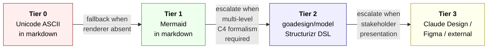
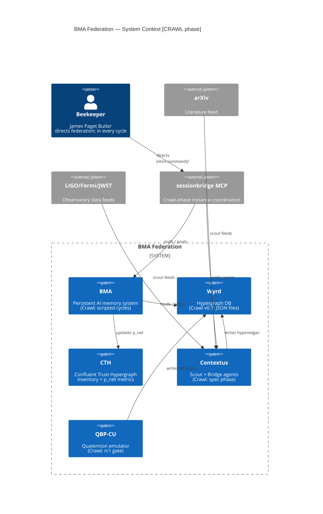
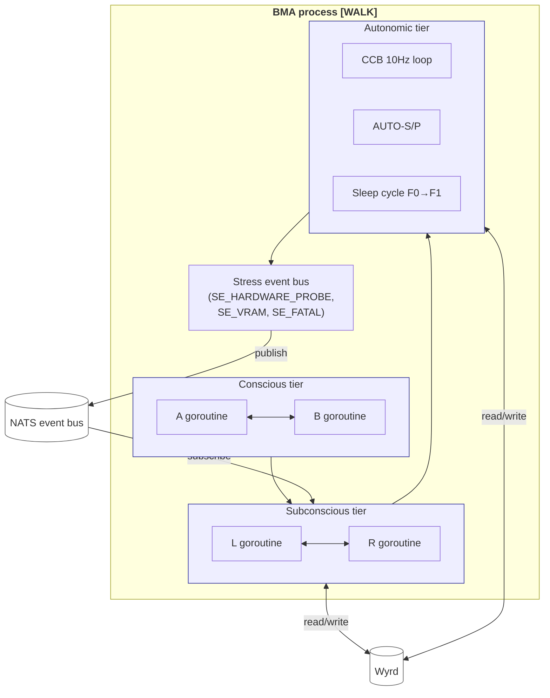
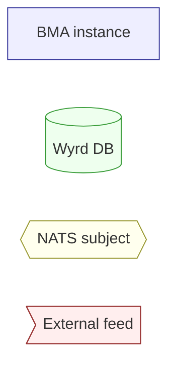
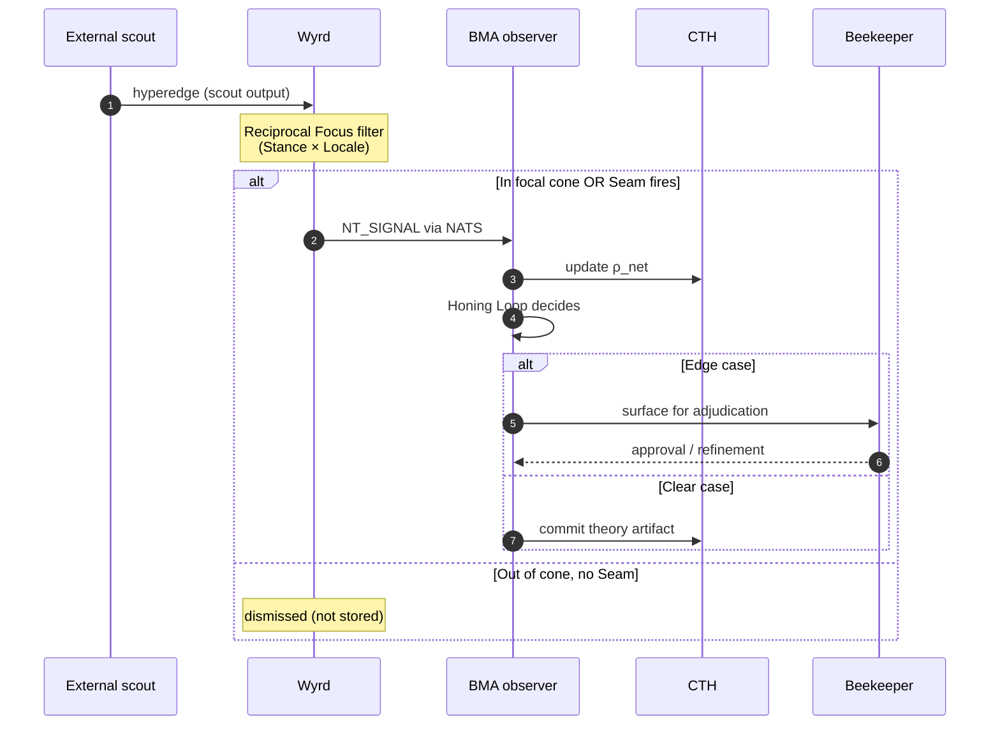
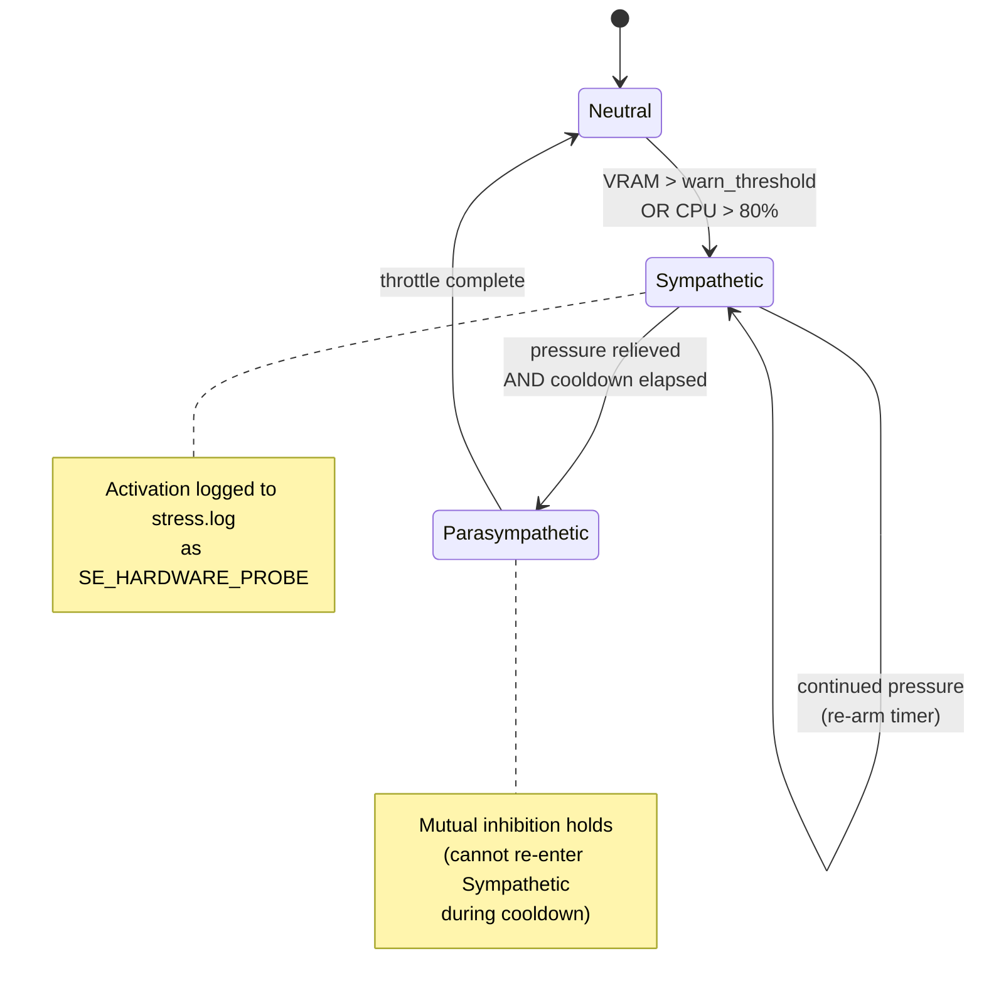
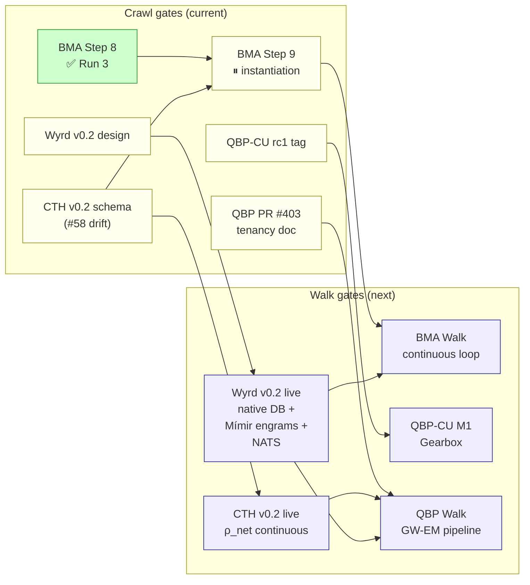

# Architecture Diagrams — Best Practices

**Workspace conventions for authoring architecture diagrams that are both human-readable and instance-readable.**

> Author: qbp-architecture (Claude Opus 4.7) + James Paget Butler
> Date: 2026-05-13
> Status: v0.1 — initial
> Scope: All architecture diagrams in workspace docs, theory docs, ADRs, and project READMEs
> Companion: `~/Documents/inter/roadmap-best-practices.md` (roadmap conventions)

---

## 1. Purpose

An architecture diagram answers **one specific question** about the system at **one specific altitude**, for **one specific audience**.

Examples of good diagram purposes:
- "How does an external scout event flow through Wyrd → BMA → Honing Loop?" (data flow, mid-altitude, implementor audience)
- "Which projects depend on which in Walk phase?" (dependency graph, high-altitude, beekeeper audience)
- "What lives inside the BMA process at runtime?" (component diagram, low-altitude, implementor audience)

A diagram that tries to be everything to everyone is a **God Diagram** and fails at all three.

---

## 2. The Visualization Tier Model

The workspace uses a **four-tier visualization model**. Pick the tier based on the audience and the fidelity required.



### 2.1 Tier 0 — Unicode ASCII in markdown

**When:** terminal-only contexts, instance-side reading where Mermaid renderer is unavailable, accessibility fallback.

**Pros:** No renderer required; works in plain text terminals; instances can author them directly.

**Cons:** Hard to read for humans at scale; cannot be re-generated from source; manual maintenance.

**House style:** Unicode box-drawing characters (`┌ ┐ │ └ ┘ ─ ↓ →`). See BMA `infrastructure/BMA-Cognitive-Foundation.md` for the canonical example.

**Use as fallback only** when Tier 1 is unavailable. Most workspace docs render on GitHub, where Mermaid is native — so Tier 1 is the default.

### 2.2 Tier 1 — Mermaid in markdown (DEFAULT)

**When:** 90% of diagrams. Project READMEs, ADRs, theory docs, workspace roadmap, phase architecture.

**Pros:** Renders natively on GitHub + most markdown viewers. Text-based (version-controllable, PR-reviewable, diffable). Wide diagram-type support (flowchart, sequence, state, gantt, timeline, C4, ER, class). No external toolchain.

**Cons:** Limited fine-grained layout control; some complex C4 diagrams need Tier 2.

**House style:** see §4-7.

**This is the workspace default.** Every new architecture diagram should be Mermaid unless there is a specific reason to escalate.

### 2.3 Tier 2 — goadesign/model (Structurizr DSL in Go)

**When:** Formal C4 model with multiple zoom levels (Context → Container → Component → Code), shared across multiple repos, where consistency matters more than authoring convenience.

**Reference:** https://github.com/goadesign/model

**Pros:** Native Go (matches our stack). Strict C4 model semantics. Single source generates multiple views. Re-usable element library across diagrams.

**Cons:** Toolchain overhead (Go module + render step). Authoring is heavier than Mermaid. Overkill for most cases.

**Workspace use:** Walk-phase architecture when complexity outgrows Mermaid. Anticipated for: federation-wide BMA + Wyrd + CTH + Contextus container model when Walk lands.

### 2.4 Tier 3 — Claude Design / Figma / external tooling

**When:** Stakeholder presentations, succession-contact briefings, HE board materials, public-facing communication. Anywhere a polished visual artifact carries the message and we need pixel-level control.

**Reference:** https://www.anthropic.com/news/claude-design-anthropic-labs (Claude Design from Anthropic Labs)

**Pros:** High visual fidelity, full layout control, branded artifacts.

**Cons:** Not version-controllable as code; manual sync to evolving architecture; expensive in authoring time.

**Workspace use:** Reserved for human-facing artifacts where the diagram itself is the deliverable, not the system documentation. Source-of-truth architecture stays in Tier 1/2; Tier 3 is the marketing/presentation layer.

---

## 3. The C4 Model — Adopted

The workspace adopts the **C4 Model** (https://c4model.com/) as the convention for architectural altitude. Every diagram declares its zoom level.

### 3.1 The four C4 levels

| Level | Zoom | Audience | Typical question |
|---|---|---|---|
| **L1 — System Context** | Highest | Stakeholders, new joiners, beekeeper | "What's in the federation and what does it talk to externally?" |
| **L2 — Container** | High | Architects, ops | "What are the deployable units inside a system and what does each do?" |
| **L3 — Component** | Mid | Implementors | "What modules live inside a container and how do they collaborate?" |
| **L4 — Code** | Low | Maintainers | "What classes/structs/functions are in this component?" |

L4 is rarely needed — well-named code documents itself. L1-L3 cover most architecture diagram needs.

### 3.2 Example — L1 System Context for the federation



That diagram answers: "what's in the federation, what's external, and how does the beekeeper interface with it during Crawl?" — one question, one altitude, one audience.

### 3.3 Example — L2 Container for BMA process at Walk



Answers: "what runs inside the BMA process at Walk and how do internal tiers connect to external persistence?" — same project as L1, but one level deeper.

---

## 4. Diagrams-as-Code Discipline

Every workspace diagram lives **in source control as text**, never as a binary artifact in the repo.

### 4.1 Why DaC

- **Version control:** PRs review architectural changes alongside code changes
- **Diffability:** "what changed in this diagram" is a real question with a real answer
- **Automation:** rendering can happen at CI time, in IDEs, on GitHub natively
- **No bit-rot:** the diagram source and the code it describes co-evolve; binary artifacts drift

### 4.2 The rule

> **If a diagram exists in the workspace, its source must be committed to a repo. Rendered images may be cached, but the source is canonical.**

Tier 0 (ASCII) and Tier 1 (Mermaid) trivially satisfy this — they ARE the source.
Tier 2 (goadesign/model) satisfies it via Structurizr DSL files.
Tier 3 (Claude Design / Figma) is the special case — these tools often produce binary output. When used, link the source artifact AND the rendered output AND keep a Tier 1/2 representation of the same architecture as canonical.

### 4.3 PR-review conventions

When a diagram changes in a PR:

- The PR description should call out the diagram change with a one-line summary
- Reviewers should render and inspect the new diagram (Mermaid: GitHub renders inline; ASCII: visual diff; Structurizr: render step)
- Material architecture changes (new container, new system boundary, new external dep) require explicit beekeeper review

---

## 5. Notation Conventions

These conventions apply to all tiers and ensure consistency across the workspace.

### 5.1 Arrows

- **Always directional.** Arrows show the flow of control, data, or causality from source to sink.
- **No bidirectional arrows.** A `<->` arrow hides complexity — either it's two separate flows (draw two arrows) or it's a synchronous request/response (label as such).
- **Label every cross-system arrow.** What does it carry? "writes hyperedges", "publishes WDEvent", "reads ρ_net".
- **Intra-system arrows may be unlabeled** when the relationship is obvious from context (e.g., goroutine A ↔ B within Conscious tier).

### 5.2 Legends

Every diagram with more than 5 distinct visual elements needs a legend. For Mermaid, this is typically done with `classDef`:



Color conventions used across workspace diagrams:

| Color | Element type |
|---|---|
| `#eef` (pale blue) | Internal instance / cognitive component |
| `#efe` (pale green) | Persistent storage / database |
| `#ffe` (pale yellow) | Event bus / message channel |
| `#fee` (pale red) | External system / data source |
| `#fff` (white) | Boundary / container grouping |

These are accessibility-safe (high contrast with black text) and consistent across all workspace docs.

### 5.3 System boundaries

Every container or system boundary must be **visually explicit**:

- Mermaid: use `subgraph` blocks with descriptive titles
- C4 syntax: use `System_Boundary` and `Container_Boundary`
- ASCII: use a labeled outer box

A diagram without boundaries blurs scaling decisions, security posture, and ownership.

### 5.4 Phase markers

Per BMA house convention, label diagrams with their phase status when ambiguity is possible:

- `[CRAWL: CONFIRMED]` — diagram describes the system as it is, today, with operational evidence
- `[CRAWL: STRUCTURAL]` — diagram describes the wiring; behavior not yet measured
- `[WALK: SPECIFIED]` — diagram describes the design target; not yet built
- `[WALK: TARGET]` — same as SPECIFIED; preferred wording
- `[RUN: THEORETICAL]` — diagram describes a future end-state; subject to change

This appears in the diagram title or as a subtitle.

---

## 6. Clarity Principles

### 6.1 One purpose per diagram

A diagram answers one question. If you find yourself adding "and also..." to the title, split into two diagrams.

Counter-example to avoid:
> "BMA architecture, security flow, deployment topology, and data persistence layers" — four diagrams in a trench coat.

### 6.2 Audience-appropriate altitude

The same architecture can be drawn at three different altitudes (C4 L1/L2/L3). Pick the one that matches the audience.

- **Stakeholder:** L1 System Context, big boxes, no internal detail
- **Architect:** L2 Container, deployable units visible
- **Implementor:** L3 Component, where in the code does this live?

A single canonical diagram is rarely possible. Three diagrams at three altitudes is normal.

### 6.3 Element budget

Soft cap: **≤9 distinct elements per diagram**. If you need more, you're probably mixing altitudes (split into multiple diagrams at different levels) or trying to show everything at once (split by purpose).

### 6.4 No God Diagrams

A "God Diagram" tries to show all systems, all data flows, all dependencies, all tiers, on one canvas. They look impressive in slide decks; they fail at every actual diagram purpose. Refuse to author them.

If a stakeholder asks for "one diagram of the whole system," respond with: "Here are three diagrams — the L1 System Context for the whole, plus L2 Container for the two specific subsystems you care about."

---

## 7. Diagram Type Selection

| Question being answered | Mermaid syntax | When |
|---|---|---|
| "Who talks to whom?" (high-level) | `C4Context` or `flowchart LR` | L1 System Context |
| "What's inside this system?" | `flowchart TB` with `subgraph` | L2 Container / L3 Component |
| "What happens in what order?" | `sequenceDiagram` | Protocol / handshake / startup |
| "What states does this thing have?" | `stateDiagram-v2` | FSM / lifecycle / phase machine |
| "Who depends on whom?" | `flowchart LR` | Dependency / build / DAG |
| "When does what happen?" | `gantt` or `timeline` | Roadmap / project schedule |
| "What data shape is this?" | `erDiagram` or `classDiagram` | Schema / type model |
| "What's the file/module structure?" | ASCII tree or `flowchart TB` | Repo layout |

---

## 8. Worked Examples

### 8.1 L1 System Context — federation at Crawl

See §3.2 for the full example. Renders inline on GitHub. Audience: beekeeper, stakeholders. Altitude: highest.

### 8.2 L3 Component — BMA cognitive cycle (sequence)



Answers: "what happens when an external scout fires an event at Walk phase?" — one question, mid-altitude, implementor audience.

### 8.3 State diagram — BMA Autonomic state machine



Answers: "what states does the BMA Autonomic layer have and what triggers transitions?" — one question, low-altitude, implementor audience.

### 8.4 Dependency graph — Walk-phase cross-project gates



Answers: "what gates block which Walk-phase outcomes?" — one question, highest altitude, beekeeper audience.

---

## 9. Anti-Patterns

### 9.1 The God Diagram

Everything on one canvas. Always failing. See §6.4.

### 9.2 The bidirectional-arrow handwave

Two systems connected by `<->`. Hides whether it's request/response, eventual consistency, two parallel pipes, or shared mutable state. Always split into two directional arrows or label as "request/response synchronous."

### 9.3 The unlabeled-edge mystery

Cross-system arrows with no label. Reader must guess what data flows. Bad in any tier.

### 9.4 The orphan diagram

Diagram exists in a doc but the doc doesn't reference it. Reader sees a picture, doesn't know what question it answers. Always introduce a diagram with one sentence: "this answers X for Y audience."

### 9.5 The drift diagram

Diagram source last updated in 2024; code architecture moved on since. Either:
- Update the diagram in the same PR as the architectural change
- Mark the diagram `[OUTDATED — needs refresh]` at the top until repaired
- Delete it (a missing diagram is better than a misleading one)

### 9.6 The screenshot

A binary PNG of a Lucidchart / Mural / Miro session pasted into a markdown doc. Cannot be diffed, cannot be edited, drifts immediately. If you encounter one in the workspace, re-author as Tier 1 (Mermaid) and delete the screenshot in the same PR.

---

## 10. Implementation Influence

Architecture diagrams should directly influence coding patterns. The diagram is the contract; the code is the realization.

- **Modular design:** Every container/component in the diagram should map to a single module with one responsibility. If the code doesn't match, either the diagram is wrong or the code is.
- **Boundary respect:** A system boundary in the diagram is a security/scaling boundary in the code. Crossings happen at named interfaces.
- **Dependency injection:** Core business logic should not import infrastructure boxes from the diagram (databases, message buses). Infra is wired in at composition root.
- **Bottleneck visibility:** Diagrams reveal latency-sensitive paths (e.g., external API calls). Code should cache / batch / async at those edges, not at random.

---

## 11. Workspace Diagram Inventory

The following diagrams exist in the workspace. Each should be re-rendered in Tier 1 (Mermaid) as their parent docs evolve.

| Diagram | Source location | Tier | Status |
|---|---|---|---|
| 7-Layer Cognitive Foundation | `BMA/infrastructure/BMA-Cognitive-Foundation.md` | 0 (ASCII) | Re-render in Mermaid at next BMA spec rev |
| Package Dependency Cascade | `BMA/Start-Here.md` §2 | 0 (ASCII) | Re-render as Mermaid flowchart |
| Autonomic State Machine | `BMA/spec/BMA-Spec-Consolidated-v9_0.md` §1.3 | Table | Add Mermaid `stateDiagram-v2` |
| Workspace Phase Architecture | `~/Documents/inter/workspace-phase-architecture.md` | 0 + 1 (both) | Mermaid added 2026-05-13 |
| Workspace Roadmap dependency graph | `~/Documents/inter/workspace-roadmap.md` §4 | 1 (Mermaid) | Added 2026-05-13 |
| QBP Federation Tenancy lifecycle | `Contextus/doc/contextus-tenancy-pattern.md` §2 | Text | Add Mermaid `stateDiagram-v2` |

---

## 12. Tooling Setup

### 12.1 Local rendering

- **VS Code:** install "Markdown Preview Mermaid Support" extension; Mermaid blocks render inline in preview
- **CLI:** `mermaid-cli` (`npm install -g @mermaid-js/mermaid-cli`) for static SVG/PNG export
- **GitHub:** native — paste a `mermaid` code block, it renders automatically in markdown views

### 12.2 Tier 2 (goadesign/model)

```bash
go install goa.design/model/cmd/mdl@latest
mdl serve <package>  # interactive editor at localhost:8080
```

Reference: https://github.com/goadesign/model

### 12.3 Tier 3 (Claude Design)

Anthropic Labs offering — see https://www.anthropic.com/news/claude-design-anthropic-labs for current state. Suitable for human-stakeholder deliverables; not for source-of-truth architecture.

---

## 13. Cross-Reference Index

| Doc | Role |
|---|---|
| `~/Documents/inter/roadmap-best-practices.md` | Roadmap conventions (parallel doc) |
| `~/Documents/inter/workspace-phase-architecture.md` | Per-phase architecture diagrams (uses these conventions) |
| `~/Documents/inter/workspace-roadmap.md` | Federation roadmap |
| `~/Documents/inter/github-best-practices.md` | Federation governance conventions |
| `~/Documents/CLAUDE.md` | Workspace-root config; cross-project hub pointer |
| https://c4model.com/ | C4 Model reference |
| https://github.com/goadesign/model | Tier 2 tooling |
| https://www.anthropic.com/news/claude-design-anthropic-labs | Tier 3 tooling |
| https://mermaid.js.org/ | Tier 1 (default) reference |

---

*Architecture Diagrams Best Practices v0.1 | 2026-05-13*
*Co-Authored-By: James Paget Butler (Beekeeper)*
*Co-Authored-By: Claude Opus 4.7 (qbp-architecture)*
