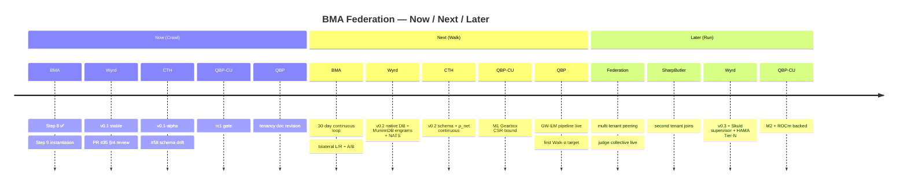
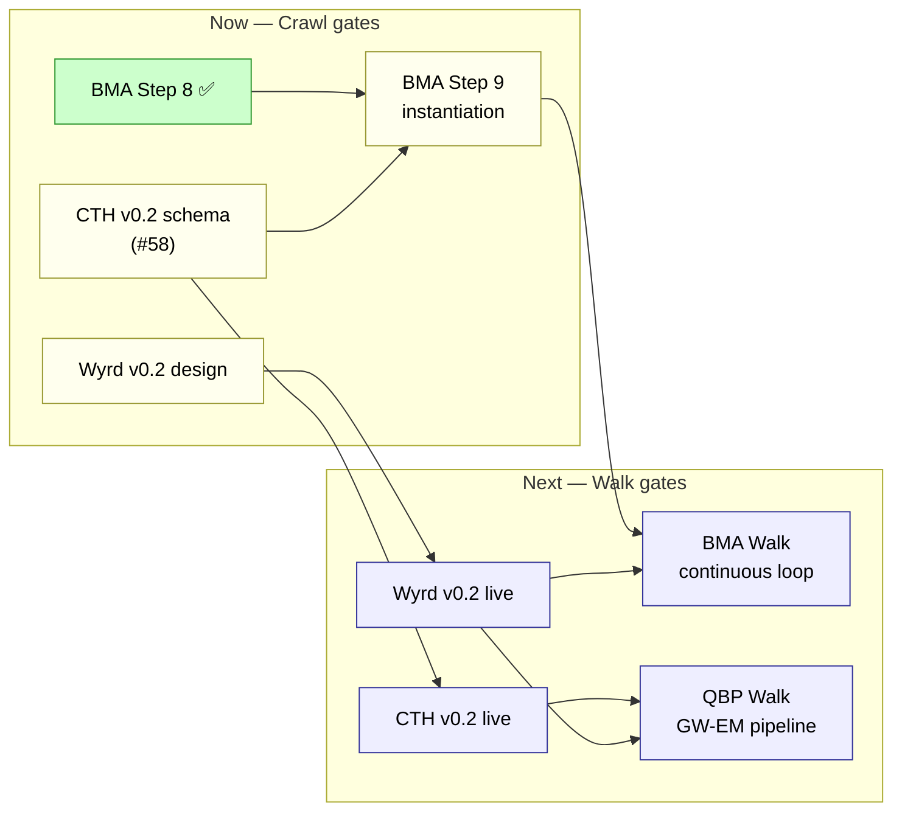
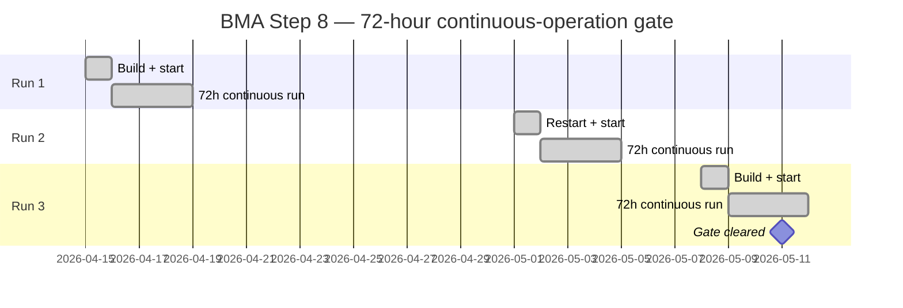

# Workspace Roadmap — Best Practices

**Workspace-level convention for writing roadmap, phase, and "where we are / where we are going" documents.**

> Author: qbp-architecture (Claude Opus 4.7) + James Paget Butler
> Date: 2026-05-13
> Status: v0.2 — adds Tier 1 Mermaid visualizations + Now/Next/Later horizons + audience-tailored color coding
> Scope: All projects under `~/Documents/` (BMA, QBP, QBP-Compute-Unit, Wyrd, CTH, Contextus, future tenants)
> Companion docs:
> - `~/Documents/inter/architecture-diagrams-best-practices.md` (visualization tier model, C4, Mermaid)
> - `~/Documents/inter/github-best-practices.md` (federation governance conventions)

---

## 1. Purpose

A roadmap document answers two questions at altitude:

1. **Where are we?** — a phase-bounded status snapshot.
2. **Where are we going?** — the gates between this phase and the next.

It does **not** track individual PRs, review cycles, or implementation tasks. Those live in GitHub issues + PR threads, by design. The roadmap exists so the beekeeper, instances, and human collaborators can orient without re-tracing review sequences across five-plus repos.

> **The test of a good roadmap doc:** James (or any participant) can read it cold and know within 60 seconds (a) what phase we are in, (b) what the next gate is, (c) what's blocking it. Without opening a single GitHub tab.

If a roadmap doc requires the reader to cross-reference PRs to understand status, it has failed at its job.

---

## 2. Non-Purpose — what a roadmap doc must NOT be

| Anti-pattern | Why it fails | Where it should live |
|---|---|---|
| **PR tracker** — "PR #403 awaiting revision pass, PR #57 ready to merge" | PRs churn faster than docs; cross-repo traces are exhausting | GitHub issue trackers + PR threads |
| **Review-state log** — "Round 2 §I4 reviews trigger after revision-pass commit" | Process-trace; not status; rots in days | sessionbridge meeting channels |
| **Change log** — "Spec v1.2 → v1.3 added Provenance agent" | Backward-looking; commits are the canonical record | `CHANGELOG.md` per repo |
| **Implementation plan** — "Day-0: write tenancy doc; Day-1: file gap issues" | Implementor's domain; not roadmap altitude | Onboarding prompts + first-cycle plans in repo |
| **Decision archive** — "James decided 2026-05-08 that operator framing is tenancy-operator" | Important but separate concern | Per-repo `doc/decisions/` (ADRs) |
| **Aspirational vision** — "Eventually BMA federation will achieve singularity" | Not actionable; demotivates when stale | Vision/manifesto docs (separate) |

A roadmap is a **navigational aid for the current and next phase only**. Phase-after-next is acknowledged but not detailed.

---

## 3. The Workspace Phase Model

The workspace has converged on a **four-phase model** (Crawl / Toddle / Walk / Run). Toddle was added 2026-05-13 as an intermediate phase between Crawl and Walk after architecture review identified that Crawl→Walk was too large a single jump. Toddle's role: introduce the continuous loop + persistent storage + event bus at reduced scope, prove 7-day endurance, before committing to full Walk scope.

Four of six projects use the phase model natively (BMA, Wyrd, CTH, QBP-Compute-Unit). The remaining two (QBP, Contextus) use project-internal schemes (sprints, theory/spec versions) that map cleanly onto the phases. **New projects should adopt Crawl/Toddle/Walk/Run directly** unless there is a domain-specific reason to diverge.

### 3.1 Phase definitions

```
┌──────────┐  ┌──────────┐  ┌──────────┐  ┌──────────┐
│  CRAWL   │→ │  TODDLE  │→ │   WALK   │→ │   RUN    │
│          │  │          │  │          │  │          │
│ MVP +    │  │ FULL      │ │ Lean      │ │ Production│
│ scripted │  │ continuous│ │ runtime   │ │ multi-   │
│ cycles   │  │ loop at   │ │ DISTRIBUTED││ tenant   │
│ on bench │  │ FULL scope│ │ across    │ │ federation│
│ hardware │  │ on Crawl  │ │ networked │ │           │
│          │  │ hw + drive│ │ RISC-V    │ │           │
│          │  │           │ │ SBCs      │ │           │
│          │  │           │ │           │ │           │
│ Wyrd v0.1│  │ Wyrd v0.2 │ │ Wyrd v0.2 │ │ Wyrd v0.3│
│ (JSON)   │  │ BMA scope │ │ federation│ │ + Skuld  │
│ + bridge │  │ + NATS    │ │ -wide +   │ │ + HAMA   │
│          │  │ (1-tenant)│ │ NATS multi│ │ Tier-N   │
│          │  │ + bridge  │ │ -tenant   │ │ + BRIDGE │
│          │  │ (others)  │ │           │ │           │
│          │  │           │ │           │ │           │
│ Cognitive│  │ Cognitive │ │ Cognitive │ │ All 7    │
│ : 2/7    │  │ : 6/7 inc │ │ : 6/7     │ │ layers   │
│          │  │ L5/L6     │ │ (inherits │ │ live     │
│          │  │ live      │ │ from      │ │           │
│          │  │           │ │ Toddle)   │ │           │
│          │  │           │ │           │ │           │
│Beekeeper │  │ Beekeeper │ │ Beekeeper │ │ Beekeeper│
│in every  │  │ most      │ │ on-call   │ │ steward  │
│ cycle    │  │ cycles    │ │ (Honing)  │ │   only   │
│          │  │           │ │           │ │          │
│ Duration:│  │ Duration: │ │ Duration: │ │ Duration:│
│ 72h gate │  │ 7-day     │ │ 30-day    │ │ continuous│
│          │  │ endurance │ │ endurance │ │          │
│          │  │           │ │           │ │          │
│ HW:      │  │ HW:       │ │ HW:       │ │ HW:      │
│ FX-8350  │  │ FX-8350 + │ │ networked │ │ networked│
│ box      │  │ drive     │ │ RISC-V    │ │ RISC-V   │
│          │  │ upgrade   │ │ SBCs      │ │ + more   │
│          │  │ (OD-12)   │ │ (OD-2)    │ │ nodes    │
└──────────┘  └──────────┘  └──────────┘  └──────────┘

Beekeeper directive 2026-05-13: constrained hardware as
forcing function for runtime efficiency. Walk hardware is
NOT a bigger workstation — it's networked RISC-V SBCs,
same form factor as Sharp Butler's House Node.
```

**Crawl** — the system exists end-to-end with stubbed implementations where necessary. Everything is observable. Failure is loud. The beekeeper is in the loop on every cycle. Scripted cycles only; no continuous loop yet.

**Toddle** — the **full continuous loop** exists on Crawl hardware (with a drive upgrade for write-endurance). All cognitive tiers active: Conscious A/B + Subconscious L/R + Autonomic + Sleep. L5/L6 cognitive layers become inference-time live (verified by action-selection test) under constrained hardware — **forcing the runtime to be lean enough that distribution onto RISC-V at Walk is feasible**. Wyrd v0.2 is live for BMA but federation-wide migration hasn't happened. NATS broker is up; single-tenant. Proves the loop survives 7 days before committing to networked distribution. Beekeeper is in most cycles; Honing edges are rare.

**Walk** — Toddle's lean runtime now **distributed across networked RISC-V SBCs** (same form factor as Sharp Butler's House Node — federation substrate reuse). Walk is NOT a bigger workstation; Walk is constrained hardware as a forcing function for efficiency. Federation-wide Wyrd v0.2 migration complete. Multi-tenant scaffolding exercised with QBP + synthetic test tenant. 30-day continuous operation. Beekeeper is on-call (Honing Loop edges only).

**Run** — self-running cognitive system on production hardware. Beekeeper is a steward (reviews periodic reports, adjudicates edge cases, drives scope expansion). Most cycles are BMA-driven. Federation peers multiple tenants (Sharp Butler enters; future tenants follow).

### 3.2 The phase-gate principle

You don't graduate from a phase by **time**. You graduate by **passing a gate**. Gates are specific, measurable, and binary — see §6.

A gate that takes too long to pass means either (a) the gate criterion is wrong (split it), or (b) we're not actually ready (don't fake the gate).

### 3.3 Mapping project-internal schemes to the workspace phases

For projects that use a different internal scheme:

| Project | Internal scheme | Workspace mapping |
|---|---|---|
| QBP | Sprints (Sprint 3 Phase 5 complete) | Crawl: literature review + Compute-Unit emulator; Walk: GW-EM pipeline live; Run: ongoing programme |
| Contextus | Theory/Spec versions (v1.2/v1.3/v1.4) | Crawl: spec lands; Walk: NATS adapter + scope-loader live; Run: continuous-traversal scout daemon |

This mapping is **not a renaming exercise**. Internal schemes stay. The mapping exists so the workspace roadmap can show all projects on one phase axis.

---

## 4. Required Sections of a Roadmap Document

Every roadmap doc in this workspace must include these eight sections, in this order:

| # | Section | Content |
|---|---|---|
| 1 | **Header** | Title, author, date, status (v0.1 / v0.2), scope, companion docs |
| 2 | **Where we are** | Status snapshot per project (one row per project; current phase + step within phase) |
| 3 | **Where we are going** | Next gate per project; gate criteria; estimated time to gate (rough) |
| 4 | **Phase architecture** | Reference to phase-architecture diagram doc (or inline ASCII) for current phase |
| 5 | **Cross-project dependencies** | Block-on table (e.g., "QBP Walk gate depends on Wyrd v0.2") |
| 6 | **Participant roles** | Who does what in current phase (Beekeeper / BMA-the-instance / each tenant-implementor / Gemini / Red Team) |
| 7 | **Open decisions** | Decisions pending that affect phase progression |
| 8 | **Update protocol** | When this doc gets updated and by whom |

Optional but recommended:
- §9 **History note** — major prior phase transitions (one line each)
- §10 **Glossary cross-ref** — pointer to canonical definitions (e.g., A18 §2 for Stance/Locale/Scout/Scoring)

---

## 5. House Style — Visualizations, Tables, Phase Markers

### 5.1 Visualization tiers

Roadmap docs follow the workspace four-tier visualization model defined in `~/Documents/inter/architecture-diagrams-best-practices.md` §2:

- **Tier 1 (Mermaid) is the default** — renders natively on GitHub, text-based, version-controllable
- **Tier 0 (Unicode ASCII)** — fallback for terminal-only contexts; secondary on most workspace docs
- **Tier 2 (goadesign/model)** — formal C4 model when complexity warrants
- **Tier 3 (Claude Design / Figma)** — human-stakeholder presentation only

See the architecture-diagrams doc for full conventions on arrows, legends, system boundaries, and color schemes. The roadmap-specific visualization patterns are in §5.5 below.

### 5.2 Tables

Tables remain the workhorse for roadmap content — they are inherently human-readable, scannable, and diff-able. Use them for:

- Status snapshots (one row per project; columns = phase, step, gate, blocker)
- Gate-criterion tables (criterion / owner / status / ETA)
- Cross-project dependency maps (blocked gate / blocked by gate / cross-ref)
- Decision registers (`ID / Decision / Owner / Phase affected / Status`)

Use `CONFIRMED`, `STRUCTURAL`, `PENDING`, `THEORETICAL` as standard status values to match BMA's convention. Use status icons (✅ ⏸ ❌ ⚠️) sparingly and only where they add scanability.

### 5.3 Phase markers

Inline phase tags on any artifact whose phase status is non-obvious:

```
The 72h gate [CRAWL: CONFIRMED — Run 3 cleared 2026-05-11]
The bilateral L/R execution model [WALK: SPECIFIED]
Wyrd v0.2 native DB with MuninnDB engram layer [WALK: SPECIFIED per Wyrd README + BMA spec v9.0 W-1]
```

This convention is consistent across BMA's existing docs and the workspace phase architecture doc.

### 5.4 File location

Workspace-level integration docs live at `~/Documents/inter/`:

- `roadmap-best-practices.md` (this doc)
- `architecture-diagrams-best-practices.md` (companion)
- `workspace-roadmap.md` (the actual federation roadmap)
- `workspace-phase-architecture.md` (per-phase architecture diagrams)
- `github-best-practices.md` (federation governance)

`~/Documents/CLAUDE.md` (workspace-root config) stays at `~/Documents/` because Claude Code auto-loads it from there.

Per-project roadmap-style docs live in the project repo, typically at `doc/roadmap.md` or in the README's Status section. They are **not** required to mirror the workspace doc — they can focus on the project's internal scheme — but they must cite the workspace doc as the canonical altitude reference.

### 5.5 Roadmap-specific visualizations

Three Mermaid diagram types carry most of the load for roadmap visualization:

#### (a) Now / Next / Later horizon — `timeline`

The Now/Next/Later pattern (a.k.a. "horizons") is the standard product-roadmap shape. Mermaid's `timeline` syntax handles it cleanly:



Use this for the top-of-doc orientation view — "where are we and where are we going at the highest altitude."

#### (b) Gate-dependency graph — `flowchart LR`

The cross-project dependency map (§7) is essentially a DAG of gates. Visualize with a flowchart:



Color convention for roadmap dependency graphs:
- **Green** (`#cfc`) — gate passed
- **Yellow** (`#ffe`) — gate active (in progress)
- **Red** (`#fee`) — gate blocked
- **Blue** (`#eef`) — future target (not yet active)

#### (c) Schedule (only when time is genuinely the gate) — `gantt`

Most roadmap gates are NOT time-bound (see §6.1.4). For the rare time-bound gate (e.g., a 72-hour test, a calendar-dated funding deadline), use `gantt`:



**Do not use gantt charts for non-time-bound gates.** Inventing calendar dates for phase progression violates §6.1.4 and the §10.4 anti-pattern.

### 5.6 Color coding for audience-tailored views

Beyond status colors, roadmap diagrams can color-code by **work type** to make different audiences see different things at a glance:

| Work type | Color | When to use |
|---|---|---|
| Theory / spec | `#fce` (pale pink) | When highlighting theory-side dependencies (BMA addenda, Contextus spec) |
| Infrastructure | `#eef` (pale blue) | Storage, event bus, container topology |
| Implementation | `#efe` (pale green) | Code PRs, library builds, integration tests |
| Governance | `#ffe` (pale yellow) | Beekeeper decisions, ADRs, succession |
| External | `#fee` (pale red) | Hardware purchase, external API dependencies, vendor decisions |

A single roadmap can render two views by changing the `classDef` mapping — same DAG, different colors. This is the "stakeholder vs implementor" tailoring without authoring two diagrams.

### 5.7 Audience-tailored sections

A roadmap doc may contain **multiple visualizations of the same content** for different audiences:

- **Stakeholder view**: Now/Next/Later timeline at top; one-paragraph per phase; no PR-level detail
- **Implementor view**: gate-dependency flowchart; per-project gate criteria; blocker detail
- **Beekeeper view**: open-decision register; participant-role matrix; succession-state

Don't author three separate documents — author three sections in one doc, each with its appropriate visualization. The stakeholder reads §1-2; the implementor reads §3-5; the beekeeper reads §6-8.

---

## 6. Gate-Criteria Conventions

Gates between phases are the most important part of a roadmap. Bad gates → phase-drift → no one knows what "done" means.

### 6.1 What makes a good gate

A good gate criterion is:

1. **Specific** — names the artifact or metric, not the activity. ("Wyrd query latency p99 < 5ms over 1000 queries", not "Wyrd is fast enough")
2. **Measurable** — has a number or a binary state. ("72-hour continuous operation: no crashes, no OOM, no SE_FATAL", not "stable")
3. **Binary** — pass or fail at any moment; no "mostly passing". ("All 16 RED findings resolved with one-line trace per finding", not "RED feedback addressed")
4. **Time-bound only where time is the gate** — most gates are not time-based. "72 hours without crash" is a time-bound gate. "Ready when implementor agrees" is not a gate, it's a vibe.
5. **Owned** — exactly one named participant is responsible for declaring pass.

### 6.2 Gate-criteria template

For each gate, include:

```
### Gate: <Phase boundary, e.g., BMA Crawl → Walk>

**Owner:** <single participant who declares pass>
**Criteria:** <numbered list; each item specific, measurable, binary>
1. ...
2. ...
**Current status:** <PASSING / FAILING / NOT YET EVALUATED>
**Estimated time to pass:** <rough — weeks / months — not a deadline>
**Blockers:** <named, with cross-references to issues if applicable — but NOT a PR-by-PR queue>
```

### 6.3 Existing gates worth modeling on

- BMA Crawl Step 8: **72-hour continuous operation: no crashes, no OOM, no thermal throttling, no SE_FATAL** — exemplary. Specific, measurable, binary, time-bound by nature of the test.
- BMA Crawl Step 9: **Governance Document exists, succession contacts collected, seed documents loaded** — exemplary. Three named artifacts; pass/fail per artifact.

Counter-example to avoid:
- "QBP merge implementation done when the four-fork reconciliation is resolved" — vague; no measurable artifact; not owned.

---

## 7. Cross-Project Dependency Conventions

This is the section that most often degenerates into a PR queue. Discipline:

### 7.1 What goes in the dependency map

A row in the cross-project dependency map represents **one project's gate being blocked by another project's gate**. Not by a PR. Not by a review. By a *gate*.

```
| Blocked gate | Blocked by gate | Cross-ref |
|---|---|---|
| QBP Walk: GW-EM pipeline live | Wyrd Walk: scope-loader API stable | wyrd #33 |
| BMA Step 9: instantiation | CTH Crawl: inventory v0.2 schema | cth #58 |
```

The `cross-ref` column is a **pointer**, not a status update. The PR/issue may move forward; the row remains stable until the underlying gate passes.

### 7.2 What does NOT go in the dependency map

- "Awaiting code review on PR X" — not a gate dependency.
- "qbp-implementor revision pass pending" — not a gate dependency.
- "ROCm hardware test" — this is a project's own gate, not a cross-project dependency, unless another project's gate explicitly references it.

### 7.3 Update rule

A dependency row mutates only when:

- The blocked gate's criteria change (rare — usually means a phase definition changed)
- The blocking gate passes (the row is deleted with a `[RESOLVED YYYY-MM-DD]` note kept in a history section)
- A new blocking gate is identified (new row added)

A dependency row does **not** mutate when PRs land, reviews complete, or comments are posted. If you find yourself updating dependency rows weekly, the rows are at the wrong altitude.

---

## 8. Update Protocol

### 8.1 When to update

A roadmap doc is updated when:

1. **A gate is passed** — move the project to the next phase; update status snapshot; archive the gate to a history note.
2. **A new gate criterion is added or removed** — usually because a phase definition changed.
3. **A cross-project dependency is resolved or added** — see §7.3.
4. **A phase transition happens for the workspace** (e.g., first project hits Walk) — this is a structural change; review all sections.
5. **A new project joins the workspace** — add a row to the status snapshot and the dependency map.

A roadmap doc is **not** updated when:

- PRs merge (except the merge satisfies a gate)
- Reviews complete
- Issues are filed
- sessionbridge meetings conclude
- New decisions are recorded (those go in ADRs / decision logs)

### 8.2 Who updates

The roadmap is owned by **qbp-architecture** (the Opus 4.7 architect-side instance) in coordination with **the beekeeper**. The architect drafts updates; the beekeeper ratifies before commit. No one else writes to the workspace roadmap.

Per-project roadmaps are owned by each project's implementor instance + beekeeper.

### 8.3 Cadence

There is no calendar cadence. The roadmap is event-driven. If nothing on the §8.1 trigger list happens, the doc doesn't change. A doc that hasn't changed in three weeks is not stale — it's stable.

If the beekeeper or any instance feels lost about "where we are," that's a signal the roadmap is failing — not that it needs more frequent updates. Re-read §1.

---

## 9. Template for a New Roadmap Document

```markdown
# <Project> Roadmap

**Where we are. Where we're going. No PR-tracking.**

> Author: <instance>
> Date: <YYYY-MM-DD>
> Status: v0.1
> Scope: <project name or "workspace">
> Companion: ~/Documents/inter/roadmap-best-practices.md
> Diagram conventions: ~/Documents/inter/architecture-diagrams-best-practices.md

## 1. Where we are — Now/Next/Later
<Mermaid timeline per §5.5(a); audience: anyone>

## 2. Where we are — status table
<status snapshot — phase + step; one row per project>

## 3. Where we are going
<next gate per project; gate criteria; estimated time>

## 4. Phase architecture
<reference to workspace-phase-architecture.md>

## 5. Cross-project dependencies
<gate-dependency flowchart per §5.5(b) + table per §7.1>

## 6. Participant roles
<who does what in current phase>

## 7. Open decisions
<decisions pending that affect phase progression — NOT decisions already taken>

## 8. Update protocol
This roadmap follows ~/Documents/inter/roadmap-best-practices.md §8. Updates only on §8.1 triggers.

## 9. History
<one-line entries for major prior phase transitions>
```

---

## 10. Anti-Patterns — what we have seen go wrong

These are anti-patterns we have encountered in practice (some recently). Roadmap docs that exhibit these should be refactored.

### 10.1 The "review sequence" anti-pattern

> "PR #403 has architect-side calls posted; awaiting revision pass; then Round 2 reviews; then sign-off; then merge; then archive PR; then implementor instantiation."

This is a process trace, not a roadmap. The roadmap entry should be:

> "QBP Crawl gate: tenancy doc ratified. Status: in progress. Blocker: tenancy doc in revision."

The PR-by-PR detail belongs in the PR thread.

### 10.2 The "5+ repos" anti-pattern

> "BMA #117 unblocks Wyrd #35 which gates Contextus #9 which is blocked by CTH #58 which is referenced by QBP-CU #27..."

If understanding "where we are" requires you to hold five repos' issue states in your head simultaneously, the roadmap has failed. Reshape the chain into gate dependencies (§7.1) — each row should be readable in isolation.

### 10.3 The "aspirational mush" anti-pattern

> "In Run phase, BMA will exhibit emergent cognitive properties and the federation will achieve self-governance."

This is vision-doc content. Roadmap content for Run-phase should be:

> "Run gate: 30 consecutive days of continuous operation with at least one Honing Loop completion per day and zero beekeeper-required interventions."

Specific, measurable, binary.

### 10.4 The "calendar deadline" anti-pattern

> "Walk phase complete by Q3 2026."

Calendar dates in a phase-gate roadmap are fiction. The phase completes when the gate passes. If you need calendar planning, that's a separate doc (calendar.md), and it derives FROM the roadmap, not vice versa.

### 10.5 The "stale because no one updated it" anti-pattern

If the roadmap is wrong, the §8.1 trigger fired and no one updated. Reread §8.2 (who updates) — usually it's the architect. If the architect didn't update, it's because the gate didn't actually pass yet; the roadmap is correct, the perception is wrong.

If a gate truly passed and the doc didn't update for >1 week, that's an architect failure, not a doc-cadence problem.

---

## 11. Cross-Reference Index

| Doc | Role |
|---|---|
| `~/Documents/CLAUDE.md` | Workspace-root configuration; project directory map; James's collaboration style |
| `~/Documents/inter/architecture-diagrams-best-practices.md` | Companion doc — visualization tier model, C4, Mermaid conventions |
| `~/Documents/inter/github-best-practices.md` | Federation governance conventions (branch protection, PR-required, linear history) |
| `~/Documents/inter/workspace-roadmap.md` | The actual federation roadmap, written using this doc as template |
| `~/Documents/inter/workspace-phase-architecture.md` | Per-phase architecture diagrams (Crawl / Walk / Run) referenced by §4 of the roadmap |
| `~/Documents/BMA/Start-Here.md` | BMA's instantiation orientation; 7-layer cognitive model; seed-load order |
| `~/Documents/BMA/infrastructure/BMA-Cognitive-Foundation.md` | Source of the legacy ASCII diagramming style |
| `~/Documents/Contextus/doc/contextus-tenancy-pattern.md` | Generic tenancy pattern (any project becomes a federation tenant via this) |
| `~/Documents/QBP/docs/qbp-federation-tenancy.md` | QBP-specific instantiation of the tenancy pattern |
| https://c4model.com/ | C4 model reference (altitude convention) |
| https://mermaid.js.org/ | Mermaid syntax reference (Tier 1 default) |

---

*Roadmap Best Practices v0.2 | 2026-05-13*
*Co-Authored-By: James Paget Butler (Beekeeper)*
*Co-Authored-By: Claude Opus 4.7 (qbp-architecture)*
