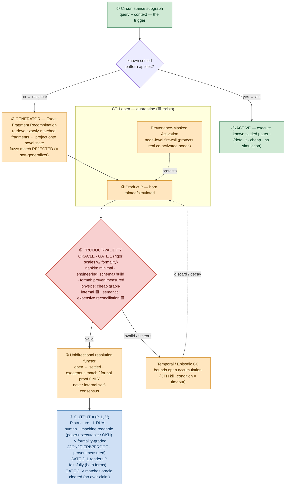

# Spike-1 architecture — bounded-simulation pipeline

Legend: 🟩 built today · 🟧 net-new build · 🟥 gap / unsolved · 🟦 partial (exists elsewhere, needs adaptation)

## Failure modes → which quality gate / test covers them
| # | Failure mode | Where | Covered by |
|---|---|---|---|
| A | Hebbian contamination ("Inception") — real nodes warped by co-activated sims | ③ Product / masking | Provenance-Masked Activation → **A-provenance** |
| B | Isomorphic brittleness — exact match rarely fires on novel states | ② Generator | **A-gen** (fire-rate, beyond-replay) |
| B′ | Abstract-type creep — abstract matching → confident-*wrong* (fail-unsafe) | ② → ④ | **A-gen** (abstract-type test) |
| C | Ledger deadlock / unbounded open accumulation | GC | **A-bound** |
| L | Laundering — simulated P read as settled | ⑤ → ⑥ | **A-launder** + Gate 3 |

## The three quality gates (good output = all three)
1. **Gate 1 — Product validity, formality-scaled** (at ④): P passes the oracle appropriate to its declared formality tier (napkin→minimal, engineering→schema/build, formal→proven `derivation` or experimentally-validated `measurement`). The physics/semantic *cost* asymmetry lives here, not in the generator.
2. **Gate 2 — Projection fidelity, dual** (at ⑥): L renders P faithfully in BOTH a human-readable and a computer-readable form; each modality needs its own fidelity oracle.
3. **Gate 3 — Provenance honesty, formality-matched** (at ⑥): CTH state (CONJ/DERIV/PROOF · ProofState · closure) is carried and **matches the oracle actually cleared** — declaring higher formality than validated is the laundering failure.

## The control structure — the pipeline is ONE STEP of a leader
A **leader** = a chain/path to an intended outcome. Nesting: **Ethics ⊃ Wisdoms ⊃ Leader(chain) ⊃ Skills/tools.**
- **Skills/tools** (settled patterns + ops: edda, Gearbox, external tools) — composed by the chain.
- **Leader/chain** — most steps run in **active mode** (settled skill matches); a step with no settled skill **escalates into the pipeline above**. A validated leader **becomes a settled skill** (→ tomorrow's active mode) = "grows and refines."
- **Wisdoms** — learned meta-guidance on how to chain well (`wisdoms/`, harvested builder-learnings); shapes path selection.
- **Ethics/morals** — hard outer envelope on which chains may be pursued (Ethics v1.1 + judge-collective); an outcome reached by violating ethics is void. Ethics forbids *pursuing* the forbidden, not *simulating* it for avoidance — that (threat-simulation, camouflage, empathy) is **Spike 3, theory of mind** (`spike-3-concept-theory-of-mind.md`).
