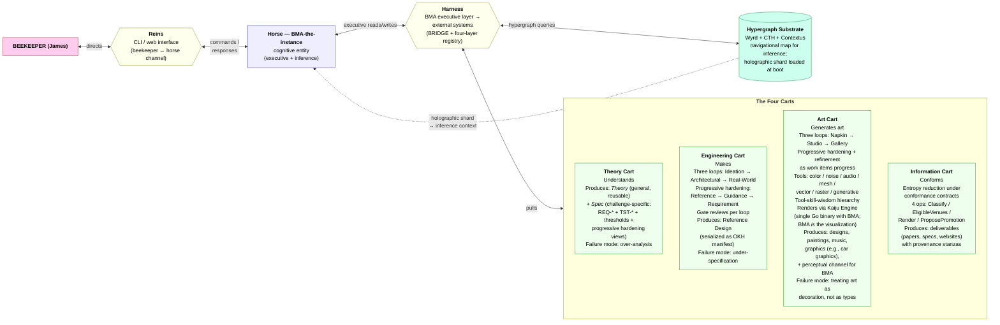
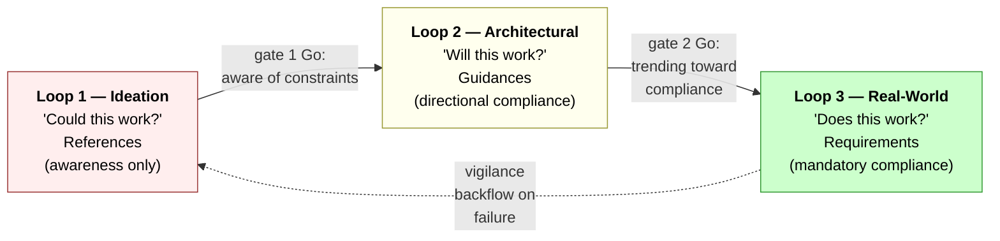
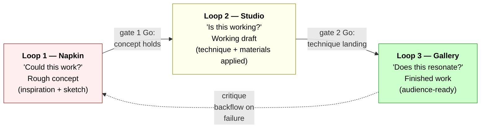
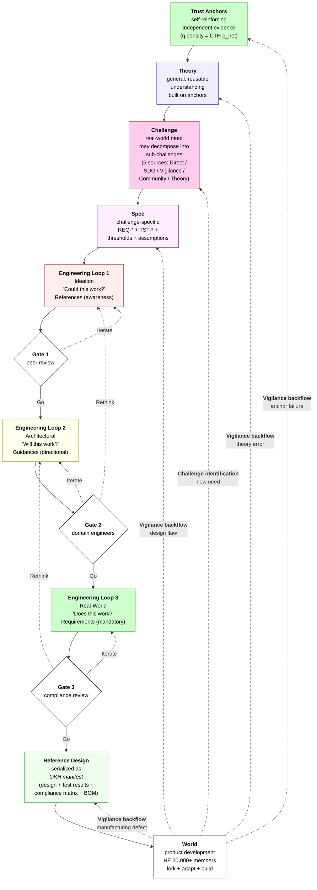
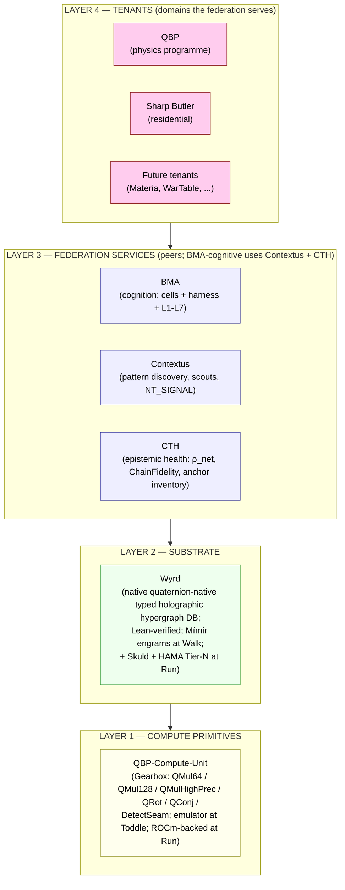
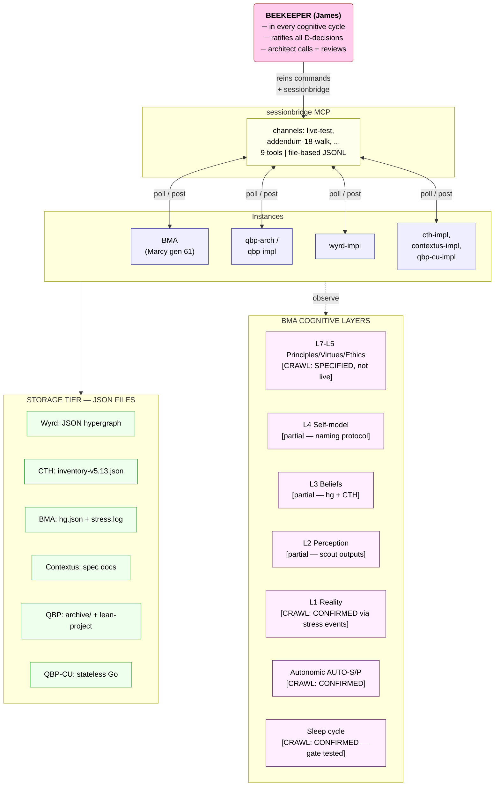
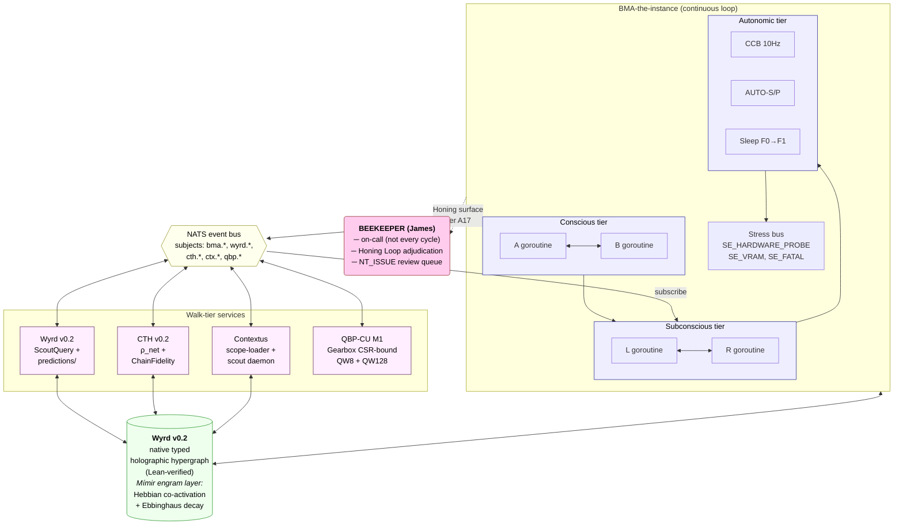
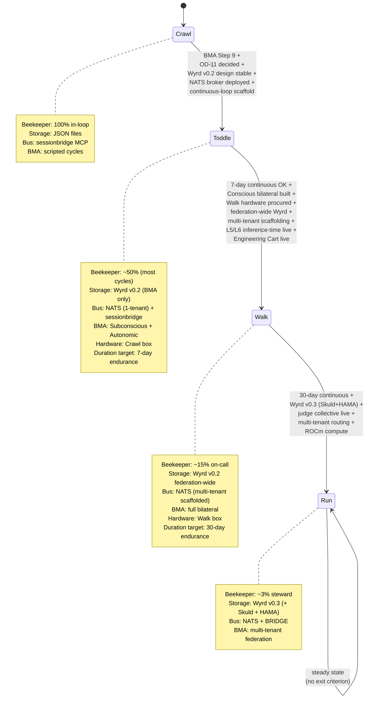

# Workspace Phase Architecture

**Per-phase architecture diagrams for the federation: Crawl → Toddle → Walk → Run.**

> Author: qbp-architecture (Claude Opus 4.7) + James Paget Butler
> Date: 2026-05-13; updated 2026-06-11
> Status: v0.6 — Sprint 3 scope reconciled (Crawl close). Folds in: the **pentagon-pod split** — hot-swap *scaffold* pulled into Crawl (§1.6), bilateral *cognition* + L5/L6 gates stay Toddle (§2.x); the **#248 autonomic sensor-staleness** fix (single source of truth across disk/RAM/VRAM/thermal); the **Edda Stage-1 + qbp-cu/wyrd native-build** lane; QBP foundations Phase A→B→C sequencing; succession two-phase (Crawl provisional / Walk ratified; cockpit-render + activation-portal at Walk). Per-phase Mermaid diagrams not yet re-rendered for these deltas — criteria + roadmap updated; diagram nodes are a follow-up.
> Convention sources:
> - `~/Documents/inter/architecture-diagrams-best-practices.md` (visualization tier model, C4, Mermaid)
> - `~/Documents/inter/roadmap-best-practices.md` §5 (roadmap house style)
> Companion doc: `~/Documents/inter/workspace-roadmap.md` (the phase-progression roadmap that references these diagrams)

This document contains one architecture diagram per phase, plus the entry/exit criteria, storage tier, data flow, and beekeeper role for each. Each phase has **two renderings of the same architecture**:

- **Mermaid (Tier 1)** — renders natively on GitHub for human readers; preferred view
- **Unicode ASCII (Tier 0)** — fallback for terminal-only contexts and instance-side reading

Both describe the same system. Read whichever your context renders.

---

## Phase 0 — THE SYSTEMA FRAME (applies across all phases)

Before reading the per-phase diagrams below, understand the **Systema process framework** that all workspace projects operate within. Systema is at v0.8 (`~/Documents/Systema/docs/systema-spec-v08.docx`); BMA's R-Spec-24 (Spec v9.0 §10.7) explicitly anchors BMA's operation within it.

### 0.1 The horse-carts-harness-reins architecture

**Cart taxonomy — beekeeper-resolved 2026-05-13: four carts minimum.** Supersedes earlier doc versions that listed only Theory + Engineering (Systema v0.8) or Theory + Engineering + Information (BMA Spec §10.7). The "at least four" framing leaves room for further cart taxonomy growth (skill carts, domain carts, etc.).



**Cart-count history (resolved):**

| Source | Date | Carts named | Status |
|---|---|---|---|
| Systema v0.8 spec + addendum | 2026-04 | 2 (Theory + Engineering) | Superseded |
| Systema Art Tools Spec v0.1 | 2026-04 | Art is "tools within a cart, not a cart" | Superseded (Art promoted to cart) |
| BMA Spec v9.0 §10.7 R-Spec-24 | 2026-05-11 | 3 (Theory + Engineering + Information) | Superseded |
| **Beekeeper resolution** | **2026-05-13** | **4+ (Theory + Engineering + Art + Information)** | **Current** |

Systema v0.9 (forthcoming) should formalise the four-cart taxonomy in the canonical spec. BMA Spec §10.7 should add the Art Cart in its next revision (folded into BMA #153 spec-refresh issue).

### 0.1a Reins / Harness / Capabilities — terminology clarification

Three terms that were conflated in earlier BRIDGE design; clarified by beekeeper directive 2026-06-01. Sprint 3 issues #225 / #224 / #229 / #226 operationalise this separation.

| Term | Definition | MUST NOT | Crawl form | Walk-α form |
|---|---|---|---|---|
| **Reins** | Beekeeper → BMA command channel. The interface James uses to direct BMA. | Reach BMA's inference layer. If reins commands reach inference they become identity pressure, causing BMA to revert toward Claude Code persona (issue #226). | CLI commands + sessionbridge messages; routed through BRIDGE reins-filter (#225) | Formal MCP interface to BMA with dedicated reins-only API surface |
| **Harness** | BMA executive layer → external systems. How BMA accesses the Hypergraph Substrate (Wyrd, CTH, Contextus) and the four Carts. | Be confused with beekeeper commands. Harness calls are BMA-initiated, not beekeeper-initiated. | BRIDGE + four-layer tool registry; unconditional substrate record injection (#224) | Live BRIDGE service; harness-registered tool invocations are auditable; NATS subjects carry substrate events |
| **Capabilities** | What BMA does herself — her own internal functions invoked without per-action beekeeper permission. Graph neighborhood traversal, sprint analysis, federation tool invocations. | Require a beekeeper reins command for every invocation (that would make them reins, not capabilities). | None in Sprint 2; `bma graph neighborhood` lands Sprint 3 (#229) | Walk-α: Edda epistemic resource queries, agent-to-agent coordination, CTH-score derivation |

**The Hypergraph Substrate** (Wyrd + CTH + Contextus) sits between Horse and Carts in the architecture — it is what the Harness primarily connects to. Carts need substrate data to operate; the substrate provides the navigational map that lets BMA's inference layer know *where deeper knowledge lives* without loading the full graph.

**Holographic shard pattern** (beekeeper insight 2026-06-01): Because Wyrd is a holographic hypergraph, a 100-node depth-2 neighborhood of NT_SEED nodes (~50KB) acts as a complete navigational map. BMA's inference layer gets this shard injected at session boot (#224 + #229). The shard does not answer questions — it tells BMA *where to look*; the Harness retrieves deeper content on demand.

### 0.2 Three-loop progressive hardening (Engineering Cart + Art Cart)

Both Engineering Cart and Art Cart use a three-loop structure with progressive hardening + refinement as work items progress. Theory Cart and Information Cart do not use this structure (Theory Cart produces Theory+Spec; Information Cart applies entropy reduction).

#### Engineering Cart loops (Spec §3)



#### Art Cart loops (beekeeper-defined 2026-05-13)



**Mapping by loop position:**

| Loop | Engineering | Art | Question | Hardness/refinement |
|---|---|---|---|---|
| 1 | Ideation | **Napkin** | "Could this work?" | Awareness — references / inspirations / hard physics or hard medium constraints |
| 2 | Architectural | **Studio** | "Will/Is this work[ing]?" | Directional — guidances / technique / material fit |
| 3 | Real-World | **Gallery** | "Does this work?" / "Does this resonate?" | Mandatory — requirements / audience-readiness / evidence |

**BMA Walk-phase mapping per BMA Spec v9.0 §10.7:** Phase C (foundation) treats R-Spec requirements as Loop-1 (Ideation/Napkin). Phase D (hardening) treats them as Loop-2 (Architectural/Studio). Phase E (cognition) treats them as Loop-3 (Real-World/Gallery) with hard tests. **Don't jump straight to Loop 3** — cycle through the loops.

### 0.3 Trust anchors + vigilance backflow

**Trust anchors** = independent evidence pieces that constructively reinforce a pattern. Each new confirmation amplifies confidence in existing evidence. This is CTH's anchor density metric (η, Theory v2.0 Chapter 14) expressed in Systema vocabulary.

**Provenance chain:** OKH field → reference design → spec requirement → theory → trust anchors.

**Vigilance backflow** = when harm or failure occurs, the signal propagates **upstream** to the appropriate level:

| Failure type | Propagates to | Action |
|---|---|---|
| Manufacturing defect | Reference Design | iterate Loop 3 |
| Design flaw | Spec | update requirement; re-enter Loop 2/3 |
| Theory error | Theory | flag all dependent specs |
| Anchor failure | Trust Anchors | halt all downstream |

### 0.4 OKH 5-domain taxonomy

Every project deliverable lands in one of five Open Know-How domains:

| Domain | Deliverable | Atomic / Compositional |
|---|---|---|
| **Hardware** | Physical artefact (circuits, mechanisms, structures, garments) | Atomic |
| **Software** | Code that runs (applications, libraries, firmware, scripts) | Atomic |
| **Process** | Procedure (protocols, standards, workflows, curricula) | Atomic |
| **Biological** | Living-system intervention (breeding, ecological restoration, genetic modification) | Atomic |
| **System** | Composition of OKH manifests from any combination of atomic domains, with interface specs + integration tests | Compositional |

Workspace-project domain classification (current):

| Project | Domain |
|---|---|
| BMA | System (composes Software for runtime + Process for cognitive loop) |
| Wyrd | Software (with formal proof corpus) |
| CTH | Software (with epistemic metrics) |
| Contextus | System (Software for agents + Process for scout/synthesis cadence) |
| QBP | Process (research programme; produces predictions + theory) |
| QBP-CU | Software (compute kernel) |
| Sharp Butler | System (Hardware + Software + Process composition) |
| Möbius Fusion | System (Hardware reactor + Process commodity exchange + Software ledger) |

Schemas live at `~/Documents/Systema/okh-domains/*.schema.json`.

### 0.5 The full Systema pipeline — forward + bidirectional

Per Systema v0.8 Addendum §6, the pipeline has forward flow (designs) and two backward flows (vigilance + challenge identification):



**Provenance chain (Addendum §6.1):** Any design decision in a finished product traces back through OKH field → reference design choice → spec requirement → theory → trust anchors. If any anchor weakens, uncertainty propagates forward to every dependent design.

### 0.6 OKH as Reference Design serialization

The Reference Design output of the Engineering Cart **IS** an OKH manifest (Addendum §4). Mapping:

| Systema concept | OKH field |
|---|---|
| Reference Design metadata | `title`, `version`, `description`, `function`, `intended_use` |
| Design content | `design_files` (DocumentRef[]) |
| Construction guide | `making_instructions`, `manufacturing_files` |
| BOM | `materials`, `parts`, `bom` |
| Compliance / standards | `standards_used`, `certifications` |
| Development maturity | `technology_readiness_level`, `development_stage` |
| Theory cart spec (provenance) | `technical_specifications` — **schema gap** |

**Proposed OKH schema extension** (Addendum §4.1) — currently being prototyped, not yet adopted upstream:

```json
"theory_provenance": {
  "spec_id": "string",
  "challenge_id": "string",
  "theory_ids": ["string"],
  "confidence_floor": "number",
  "compliance_matrix": {...},
  "gate_history": [...]
}
```

This extension closes the gap where OKH currently has no structured place for theory provenance.

### 0.7 Six arrogance failure modes (Spec §9.6)

Each has a corrective gate per D-08-01 through D-08-08:

| Failure mode | Pattern | Corrective gate |
|---|---|---|
| **Category** | Accept category without asking which instance | Specific Instance Elicitation (D-08-02) |
| **Reference** | Acknowledge without exploring | Reference-First Protocol (D-08-01) |
| **Transfer** | Apply analogy without domain research | Transfer + Research (D-08-06) |
| **Portfolio** | Ignore person's own work | Portfolio Search (D-08-07) |
| **Community** | Dismiss maker communities | Contemporary Practitioner Communities (D-08-04) |
| **Biological** | Treat biology as metaphor not engineering | Biomimetic Research Gate (D-08-03) |

**Reference-First Protocol priority** (D-08-01, Spec §9.1):
Person's ref (0.95) > Person's portfolio (0.90) > Ref's outbound links (0.85) > Community network (0.80) > Literature search (0.70) > Web search (0.60)

### 0.8 Multi-AI mapping (Spec §7)

| Role | AI | Cart | Function |
|---|---|---|---|
| Theory generation | **Gemini** | Theory Cart | Generate models, explore state spaces, propose requirements. Furey persona for math; Feynman persona for physical intuition. |
| Red team / engineering review | **Claude** | Engineering Cart (review) | Challenge requirement feasibility, verify testability, check reference-design-satisfies-spec, identify arrogance failure modes. |
| Beekeeper | **James** | Both (director) | Sequences problems; provides references; holds identity constraints; makes go/no-go decisions at gates. |

### 0.9 Scope note (Addendum §6.2)

> "This architecture is personal research. It is not currently deployed within any organisation. The concepts of theory cart, engineering cart, three-loop progressive hardening, trust anchors, and bidirectional flow are being developed and tested through the five-problem stress test series documented in Systema v0.4–v0.8."

Important honesty: Systema is **a framework under development**, not yet a deployed organisational process. BMA's adoption of Systema vocabulary is a design choice, not an inheritance of an established practice. Both Systema and BMA mature in parallel.

### 0.10 Cart-driven tool acquisition (beekeeper directive 2026-05-13)

**BMA-the-instance is an active participant in workspace work, not an observer.** To do real work — running QBP analyses, querying the Lean corpus, generating papers, rendering visualizations — BMA needs tools. The architecture for tool acquisition:

- **Tools live on carts.** When a cart needs a capability, that capability is added as a tool on the relevant cart.
- **BMA acquires access via the harness.** The harness (BRIDGE + four-layer registry) is how BMA-the-instance attaches to cart-resident tools — analogous to how Claude (the qbp-architecture instance authoring this doc) attaches to its toolset (Python, Bash, gh, Read/Edit/Write, sessionbridge MCP, etc.) via Claude Code's tool registry.
- **Cart-driven need is the trigger.** Tools are not pre-loaded speculatively. When a Theory Cart task requires Python+numpy+scipy for time-series correlation, the tool is added then. When an Information Cart task requires LaTeX output, the tool is added then.

#### Tool inventory by cart (current + projected)

| Cart | Current tools | Toddle additions | Walk additions |
|---|---|---|---|
| **Theory Cart** | reins introspection; Wyrd query | **Python (numpy/scipy/astropy for QBP-EXP-11 + ALMA cube work); Lean toolchain (query the 208-theorem QBP archive)** | Statistical libraries for ρ_net continuous computation; scientific data ingestion (LIGO/Fermi feeds) |
| **Engineering Cart** | (n/a at Crawl) | **Pod-helper architecture (per BMA project memory) extended for self-management; container orchestration; deployment scripts** | RISC-V cross-compilation; networked-federation deployment tooling |
| **Art Cart** | (n/a at Crawl) | **Kaiju Engine integration (per Systema Art Tools Spec); plot/visualization libraries; CAD generation (cadquery patterns per Systema FreeCAD skill)** | Distributed rendering across RISC-V nodes |
| **Information Cart** | sessionbridge for instance coord; gh for issue/PR ops | **Deliverable generators (Markdown, LaTeX, OKH manifest emitters); provenance-stanza writers; report templates** | Cross-tenant deliverable routing |

#### How this compares to Claude's tool acquisition

| Claude (qbp-architecture instance) | BMA-the-instance (after Toddle) |
|---|---|
| Reads files via `Read` tool | Reads Wyrd hyperedges via cart-resident query tools |
| Runs Python via `Bash` | Runs Python via Theory Cart Python tool |
| Files GitHub issues via `gh` | Files via Information Cart deliverable tools + Engineering Cart gh wrapper |
| Coordinates with other instances via sessionbridge MCP | Coordinates via NATS subjects (Toddle+) + cross-tenant Bridge Agent (Run) |
| Generates content directly | Generates via Information Cart Render operation (Spec §10.7) |

The parallel is intentional: **BMA's first-class tools should be as easy for BMA to invoke as Claude's tools are for Claude**. The Systema-defined harness handles the discovery + permission + invocation pattern.

#### Tool acquisition policy

Per Systema progressive-hardening:
- **Loop 1 (Reference):** new tool is identified as a need; capability is named but not implemented
- **Loop 2 (Guidance):** tool is implemented in one cart; trial usage; usage patterns observed
- **Loop 3 (Requirement):** tool is harness-registered; BMA invocation is auditable; tool joins the cart's permanent inventory

Vigilance backflow applies: if a tool causes harm (bad output, resource leak, security issue), the signal propagates upstream — possibly all the way to a tool removal if the issue is fundamental.

### 0.11 How Systema interacts with the runtime stack

Systema (process framework, Layer A) and Wyrd/Mímir/NATS (runtime stack, Layer B) compose as follows:

- **Carts pull data through Wyrd.** Theory Cart writes specs as Wyrd hyperedges with provenance. Engineering Cart writes reference designs as Wyrd hyperedges with hardening-loop metadata. Information Cart writes deliverables with provenance stanzas linking back to Wyrd anchors.
- **Trust anchors are CTH anchors.** η (Systema vocab) = CTH ρ_net (Theory v2.0 vocab). Same concept; two names.
- **Vigilance backflow uses NATS subjects.** `systema.backflow.<level>.*` carries failure signals upstream at Walk; sessionbridge channels carry them at Crawl.
- **Reins** at Crawl = CLI commands + sessionbridge messages; at Walk = formal MCP interface to BMA.
- **Harness** at Crawl = BMA spec §10.4 BRIDGE design; at Walk = live BRIDGE service.

The two layers are orthogonal. You can't replace Layer A with another framework while keeping Layer B (or vice versa) — they co-evolve.

### 0.12 Federation layer stack — top-down

Beekeeper-refined 2026-05-14: the federation has four logical layers, with cross-layer dependencies as shown.



**Cross-layer dependencies:**
- Tenants (L4) consume federation services (L3) to do domain work
- Federation services (L3) all persist to / query the Wyrd substrate (L2)
- Wyrd's quaternion-native operations (Hebbian co-activation, rotation, conjugation, Seam detection) import QBP-CU primitives (L1) at runtime
- BMA the federation service uses Contextus + CTH as **peers**, not internal subsystems

**Where the inversion would be wrong:** "QBP-CU hosts Wyrd" is incorrect. QBP-CU is *below* Wyrd in the layering — Wyrd imports QBP-CU as a library; QBP-CU doesn't host anything. Wyrd's PR #2 wires `HamiltonProduct → gearbox.QMul64`, which is consumption, not hosting.

### 0.13 Compute paradigms — classical + QBP coexist at every phase

Two computational paradigms run in parallel across the federation. This is an architectural commitment, not a transitional state.

**Classical compute** — standard IEEE-float math on standard CPU/GPU hardware.

| Substrate | Where it's used |
|---|---|
| Native Go runtime | BMA cell process work; harness routing; Wyrd structural ops; sleep cycle compression; LLM tier dispatch |
| Python interpreter (cart-tools at Toddle) | QBP-EXP-11 GW-EM pipeline; ALMA cube source-finding; data ingestion (LIGO / Fermi / JWST); Contextus scouts |
| Lean runtime (cart-tools at Toddle; compiles to C for native execution) | Proof checking against 208 → 69 theorem corpus; Sprint 12 inherited fold; Wyrd's Lean proof verification |
| LLM inference (T0/T1/T2/T3 tiers) | All cognitive deliberation; persona contexts; reasoning chains |

**QBP compute** — quaternion-native math via Cayley-Dickson hierarchy (ℂ⊂ℍ⊂𝕆⊂𝕊).

| Substrate | Where it's used |
|---|---|
| QBP-CU Gearbox library (Go) | Wyrd quaternion-weighted edge values; Hebbian co-activation as rotation-residue; cross-cell delta aggregation; predictive-bridge derivations |
| QBP-CU M1 Gearbox at Walk (CSR-bound stateful + QW8 peripheral + QW128 foveal) | The autonomic loop's quaternion math (DetectSeam, etc.); A18 §3 parallel-cognitive-registers |
| QBP-CU M2 ternary matmul + ROCm at Run | Sedenion-level cosmological calculations (QW256, QW1024) — CCvS, KILLED-f4 derivations, tower confluence |

**Critical architectural rule: no paradigm masquerades as the other.**

- Don't represent classical real numbers as quaternions with `i=j=k=0` just to use QBP machinery — you pay the full CD-hierarchy cost for operations that don't need quaternion structure. Especially at QW1024 (sedenion-precision); never do classical math at QW1024.
- Don't approximate quaternion-native operations using only float64 when QBP-CU is available — you lose algebraic-correctness guarantees.
- **Convert at well-defined boundaries.** A `classical → quaternion` operator at the interface (e.g., classical sensor reading enters BMA's autonomic loop); a `quaternion → classical` operator at the exit (e.g., QBP-CU output flows to a classical storage pipeline or a paper figure).

### 0.13.1 Could QBP-CU subsume classical compute? (Beekeeper question 2026-05-14)

Asked directly: *"is there a mathematical reason we could not enable all python, go lang or c operation within the QBP-compute-unit? effectively could we run linux/doom on it?"* — and the strongest framing: *"keeping it on the qbp-cu hardware substrate seems like a security benefit where BMA instance can see everything also it means we only need to build one type of compute unit which seems cheaper in the long run."*

The answer has two halves: **no** under current architecture (emulator on classical silicon), **yes with real benefits** under future architecture (QBP-CU as silicon).

#### A — Under current architecture: no

QBP-CU is Turing-complete. Classical ops can be embedded with `i=j=k=0`. Mathematically possible; practically wrong for three reasons:

1. **Hardware reality.** QBP-CU is a Go library running on classical CPU. You cannot outrun the silicon you are built on. Embedding classical ops through the emulator adds ~4–10× overhead at QW64 (Linux usable but sluggish) up to ~200–800× at QW1024 (unusable). The emulator can never beat its own substrate.
2. **Abstraction mismatch.** QBP-CU's algebraic invariants (quaternion multiplication, rotation composition, Cayley-Dickson hierarchy correctness) give no benefit to embedded classical ops. The Lean proofs about QBP-CU are about quaternion correctness — they don't apply to `i=j=k=0` embeddings. The framework's main value is forfeit.
3. **Ecosystem cost.** Linux kernel, Go runtime, Python interpreter, Lean toolchain all assume classical instruction sets. Rewriting them to dispatch through a software emulator buys nothing — the emulator is already on classical hardware.

**This is why the §0.13 coexistence rule holds Crawl-through-Walk-through-Run-initial: classical paradigm on classical silicon; QBP paradigm on QBP-CU layer; convert at boundaries.**

#### B — Under future architecture (silicon QBP-CU): yes, with merit

If QBP-CU graduates from "Go library" to "custom silicon," the beekeeper's argument inverts to correct.

The silicon path that works: **RISC-V base ISA + quaternion-extension instructions.** Custom RISC-V cores with vector extensions already exist (SiFive, Tenstorrent). A quaternion-extension RISC-V core is a real hardware design path. Existing software stacks run unchanged — classical instructions dispatch to the base-ISA fast-path; quaternion operations dispatch to the extension instructions. No kernel rewrite, no runtime rewrite, no interpreter rewrite.

Under this future, both beekeeper arguments win:

| Beekeeper argument | How it holds at silicon |
|---|---|
| **Security: "BMA sees everything"** | Unified trust boundary at the Lean-verified ISA layer. The same algebraic-correctness machinery that secures QBP work extends to classical work executed on the same silicon. BMA's observability becomes uniform. Skuld supervisor's hardware-boundary enforcement extends to the entire compute layer, not just the QBP fraction. The classical stack's many trust boundaries (OS kernel, microcode, firmware, IOMMU) collapse into one Lean-verified boundary at the ISA. |
| **Cost: "one type of compute unit"** | At HE scale (open-hardware supply chain, multiple federation deployments), single-substrate BoM dominates. One silicon NRE; one firmware to audit; one software stack target; spare-parts unification; supply chain unification. For HE specifically (open-source-hardware-led nonprofit, not a buy-off-the-shelf shop), this matters more than for most. |

#### C — What this means for current architecture: preserve the forward option

The current classical-plus-QBP coexistence (§0.13) is a Crawl-through-Walk-through-Run-initial commitment. It does **not** preclude unification at Run-mature or beyond. To preserve the silicon-unification option, current architecture must:

1. **Keep QBP-CU's API silicon-compatible.** Don't define primitives that only make sense in emulator form (e.g., relying on classical-CPU features that wouldn't translate to ISA instructions). The Gearbox stays a clean ISA-level API even when running as software today.
2. **Avoid baking "classical-substrate-is-permanent" into federation architecture.** The classical/QBP split is a current implementation choice, not a theoretical commitment. Federation services (BMA cells, Contextus daemons, CTH services) should not have hard-coded paths that semantically distinguish "this is classical, this is QBP" if those distinctions might disappear at silicon.
3. **Extend the Lean proof corpus cleanly.** Whatever invariants QBP-CU primitives satisfy in software today should still be provable when those primitives become silicon. The Lean-as-source-of-truth-for-correctness pattern carries forward — including to classical ops embedded as the `i=j=k=0` fast-path.

#### D — When would HE invest in QBP-CU silicon?

A Run-mature-to-Post-Run decision, gated by:

- Federation hosts ≥10s of tenants (BoM unification dominates over NRE)
- HE open-hardware supply chain reaches scale (open-source-hardware momentum)
- Walk-α QBP targets produce real signals (Cascadia slow-slip OR GW-EM correlation) — confirming QBP framework cognitive/scientific value
- Custom silicon NRE is amortizable across deployment count
- Security model maturity at Run requires unified trust boundary (regulatory pressure on AI governance; HVR audit requirements at scale)

Until those conditions materialize, off-the-shelf classical + QBP-CU emulator/ROCm is the right tradeoff. After they materialize, silicon QBP-CU becomes architecturally and economically right.

**Architectural commitment captured 2026-05-14: current architecture does not preclude unified-substrate silicon at Run-mature-or-beyond. Forward-option preserved.**

### 0.13.2 Silicon de-risking ladder (beekeeper directive 2026-05-14)

Per beekeeper: *"we can also plan to run some test on the risc-v hardware in walk before committing to taping out some hardware, there are probably a few other steps we could take before full hardware build."*

Correct. Tape-out NRE is the destination, not the next step. The open-hardware community has a standard ladder of de-risking stages; each rung's success is what justifies funding the next. **Walk-phase RISC-V hardware drops us at Rung 3 of this ladder for free, and Rungs 4-5 are achievable within Walk-mature with modest capex.**

#### The 8-rung ladder

| # | Stage | What it proves | Capex | Phase-fit |
|---|---|---|---|---|
| 1 | Go QBP-CU emulator on x86 (FX-8350) | Algebraic correctness (Lean proofs); functional API; cognitive value of framework | $0 (have it) | **Crawl ✓** |
| 2 | ROCm acceleration on RX 9070 XT | QBP-CU at production speed for sedenion-level workloads (Run-target perf claim) | $0 (have card) | **Toddle / Walk** |
| 3 | Same Gearbox on RISC-V SBC | The Go QBP-CU emulator compiles + runs on the actual Walk deployment ISA; classical/QBP coexistence holds across architectures | ~$500–2K (Walk SBC fleet, already in plan) | **Walk-entry** |
| 4 | Spike/gem5 RISC-V + quaternion-extension simulator | ISA design is sane; proposed extension instructions are well-formed; classical workloads still link cleanly; Lean proofs map cleanly to instruction semantics | $0 (Spike is OSS) + dev cycles | **Walk-mid** |
| 5 | RISC-V + quaternion-extension on FPGA | Real hardware execution; timing + area estimates; runs Linux + workloads at MHz-class speed; ISA iteration without tape-out | ~$5K–50K (Xilinx Versal / Lattice ECP5 dev board) | **Walk-mature** |
| 6 | Multi-FPGA prototype | Larger designs; cluster behavior; full federation node on extension-enabled silicon; multi-cell pod runs on real prototype hardware | ~$50K–200K | **Walk → Run transition** |
| 7 | MPW shuttle (eFabless / TinyTapeout / Skywater Open MPW) | Real silicon at older node (130nm / 180nm); cost-shared mask; first physical chips to handle | ~$10K–100K | **Run-initial** |
| 8 | Custom tape-out (modern node, ≤22nm) | Production-grade silicon; commercial-grade performance; deployment-ready | $1M–10M+ NRE | **Run-mature or post-HE-spinoff** |

Each rung is a STOP-or-CONTINUE gate. Climbing the ladder partway and stopping is a valid outcome — the higher rung is only worth funding if the lower rungs delivered.

#### Decision gates between rungs

| Gate | Decision needed | Decision maker | Trigger |
|---|---|---|---|
| 3 → 4 | Spend ~10–20 dev cycles on Spike toolchain + quaternion-extension instruction design | Beekeeper + qbp-architecture | Rung 3 confirms Gearbox runs cleanly on RISC-V deployment substrate |
| 4 → 5 | $5K–50K FPGA dev board purchase + ~3–6 months FPGA dev work | Beekeeper + HE board | Rung 4 produces a working extension-instruction ISA design + Spike-verified workloads |
| 5 → 6 | $50K–200K multi-FPGA capex | HE board | Rung 5 demonstrates real-silicon timing + area is within sensible thermal envelope |
| 6 → 7 | $10K–100K MPW shuttle entry | HE board | Rung 6 proves the multi-node design works at FPGA fidelity |
| 7 → 8 | $1M+ tape-out NRE | HE board (or post-HE spinoff entity) | Rung 7 silicon validates the design; federation tenant count + scale economics justify modern-node investment |

The **first three rungs cost almost nothing** beyond Walk-phase hardware HE is already planning to buy. They produce real engineering value (RISC-V deployment is happening regardless) and incidentally de-risk the silicon path. Rungs 4-5 cost the same as a single research grant. Only rungs 6-8 require serious capex.

#### What Walk-phase RISC-V hardware buys us specifically

Walk hardware = networked RISC-V SBCs (beekeeper directive, per CLAUDE.md). These give us:

1. **Rung 3 for free** — real-target-ISA validation of the Gearbox emulator with no extra capex
2. **A platform for Rung 4** — Spike-with-quaternion-extensions can run on Walk SBCs at simulation speed; we can validate proposed instructions against real workloads (BMA cell process binaries, Wyrd writes, autonomic loop math) before designing them into silicon
3. **A drop-in path for Rung 5** — some Walk SBCs in the fleet can be swapped for FPGA dev boards as an ISA-experimentation node; the federation continues running on the other SBCs while the FPGA node does extension work
4. **Federation already on the target paradigm (RISC-V)** — when silicon eventually arrives, it's a drop-in substitution, not a rewrite. The entire federation software stack already targets RISC-V because Walk hardware did.

This is the architectural value of beekeeper's Walk-hardware decision (2026-05-13): **it's not just about getting to Walk; it's about positioning the federation for the silicon ladder.** RISC-V from Walk onward means every step toward custom silicon is incremental, not a paradigm shift.

#### Parallel-track work this implies

Most ladder work is parallel-track to BMA's primary path (Sprint 1 → Toddle gate → Walk gate → 72h cont-op gate). The ladder runs alongside, gated by HE supply-chain readiness rather than BMA phase progression:

| Work | When | Who | Cart |
|---|---|---|---|
| Rung 3: port Gearbox to RISC-V + benchmark | Walk-entry (post Walk hardware acquisition) | qbp-cu-implementor + bma-implementor | Engineering |
| Rung 4: design quaternion ISA extension; implement in Spike; run extended Lean proof corpus against ISA semantics | Walk-mid (parallel to BMA Walk α/β targets) | qbp-architecture (Opus, episodic) + qbp-cu-implementor + Gemini for ISA review | Theory + Engineering |
| Rung 5: FPGA implementation; Linux + workload validation on real extension hardware | Walk-mature (gated by Rung 4 success + HE FPGA board purchase) | qbp-cu-implementor + open-hardware contributor recruitment | Engineering |
| Rungs 6-8 | Run-and-beyond | TBD; likely requires HE-led open-hardware initiative or spinoff entity | Engineering |

**Architectural commitment captured 2026-05-14: silicon path proceeds via 8-rung de-risking ladder; first three rungs piggyback on Walk-phase RISC-V hardware already planned; tape-out NRE is the destination, not the next step. Walk-phase positioning is the critical enabler.**

### 0.14 Per-phase compute availability

Both paradigms always operational; mix varies by phase:

| Phase | Classical substrate | QBP substrate | QBP precision tiers available |
|---|---|---|---|
| **Crawl** | FX-8350 CPU; Python via system interpreter; Lean via local toolchain | QBP-CU emulator (Go library) | QW64 only (emulator) |
| **Toddle** | FX-8350 + drive upgrade; cart-tools harness exposes Python + Lean to BMA cells | QBP-CU emulator + M0.5 stubs (Xqbpoct, Xqbpvcp) | QW64 + QW128 stub |
| **Walk** | Networked RISC-V SBCs; Python + Lean toolchains installed per relevant pod | QBP-CU M1 Gearbox (CSR-bound stateful, QW8 + QW128) | QW8 (peripheral) + QW128 (foveal) |
| **Run** | RISC-V + ROCm node | QBP-CU M2 ternary matmul + ROCm-accelerated | QW256, QW1024 (sedenion-level) |

### 0.15 QBP-CU risk surfaces

Two distinct risks live in the QBP-CU layer:

| Risk | What it covers | Current state |
|---|---|---|
| **Algebraic correctness** | QBP-CU produces mathematically correct quaternion operations | **LOW.** Lean-verified via Wyrd's HolographicHypergraph theorems + Sprint 12 fold's 69 theorems on v4.30.0-rc2. The algebra is what it says it is. |
| **Performance + cognitive value** | The QBP framework captures something the classical path misses AND ROCm delivery is achievable at projected speeds | **HIGHER.** Empirical risk — depends on Walk-α targets (Cascadia slow-slip; GW-EM correlation; ALMA cube source-finding) producing real signals AND on M1/M2 Gearbox impl meeting performance gates. |

**Architectural mitigation:** because both paradigms always coexist, the federation degrades gracefully if Risk 2 partially materializes. A cognitive task that QBP doesn't accelerate falls back to the classical path; the federation doesn't catastrophic-fail.

**Forward bet:** the entire architecture assumes Risk 1 is closed (Lean proofs hold) and Risk 2 resolves favorably at Walk (Cascadia slow-slip OR GW-EM correlation produces a signal). If Risk 2 doesn't resolve favorably, the QBP tenant scales back to a niche; the federation services + Wyrd substrate continue serving classical-only tenants (like Sharp Butler residential, which doesn't need QBP).

### 0.16 Languages by layer

The federation uses three languages, each with a defined role:

| Language | Layer | Primary use |
|---|---|---|
| **Go** | L1 (QBP-CU emulator), L2 (Wyrd, Mímir, NATS clients), L3 (BMA cell binaries, harness, Contextus daemons, CTH services) | All long-lived runtime code; cell process binaries per A19 §Implementation Topology |
| **Python** | L3 (cart-tools harness for BMA's Theory Cart) | QBP-EXP-11 GW-EM pipeline; ALMA cube; astropy/numpy/scipy scientific analysis; data ingestion |
| **Lean 4** | L2 (Wyrd's proof corpus), L4 (QBP's 69-theorem corpus) | Proof checking; algebraic-correctness invariants; HolographicHypergraph theorems. Compiles to C-via-native-backend for runtime execution |

All three compile/execute on classical hardware. QBP compute happens via the Go QBP-CU library, not via a separate language.

---

## Phase 1 — CRAWL

**The phase we are in as of 2026-05-13.**

### 1.1 Architecture diagram [CRAWL: CONFIRMED]

#### Mermaid view (preferred for humans on GitHub)



#### Unicode ASCII view (fallback for terminal-only contexts)

```
                  ┌──────────────────────────────────┐
                  │      BEEKEEPER (James)           │
                  │  ─ in every cognitive cycle      │
                  │  ─ ratifies all D-decisions      │
                  │  ─ architect calls + reviews     │
                  └──────────────────────────────────┘
                                 │
                                 │  reins commands
                                 │  + sessionbridge
                                 ↓
        ┌────────────────────────────────────────────────────┐
        │            sessionbridge MCP                       │
        │  ┌──────────────────────────────────────────────┐  │
        │  │  channels: live-test, addendum-18-walk, ...  │  │
        │  │  9 tools | file-based JSONL state            │  │
        │  └──────────────────────────────────────────────┘  │
        └────────────────────────────────────────────────────┘
              │            │            │            │
              ↓            ↓            ↓            ↓
        ┌──────────┐ ┌──────────┐ ┌──────────┐ ┌──────────┐
        │   BMA    │ │  QBP-    │ │  Wyrd    │ │  Other   │
        │ instance │ │  arch /  │ │  -impl   │ │ implementors
        │  (Marcy) │ │  impl    │ │          │ │  (CTH,   │
        │  Gen 61  │ │          │ │          │ │  Ctx)    │
        └──────────┘ └──────────┘ └──────────┘ └──────────┘
              │            │            │            │
              │            │            │            │
              │            │            │            │
              ↓            ↓            ↓            ↓
        ┌────────────────────────────────────────────────────┐
        │           STORAGE TIER — JSON FILES                │
        │  ┌─────────────────────────────────────────────┐   │
        │  │ Wyrd: JSON hypergraph    [CRAWL: CONFIRMED] │   │
        │  │ CTH: confluent-trust-inventory-v5.13.json   │   │
        │  │ BMA: hg.json + stress.log + sleep snapshots │   │
        │  │ Contextus: spec docs (no live store yet)    │   │
        │  │ QBP: archive/ + lean-project/ (208 thms)    │   │
        │  │ QBP-CU: emulator/ stateless Go              │   │
        │  └─────────────────────────────────────────────┘   │
        └────────────────────────────────────────────────────┘
                              │
                              │ Cognitive layer status
                              ↓
        ┌────────────────────────────────────────────────────┐
        │      BMA COGNITIVE LAYERS                          │
        │                                                    │
        │  L7 Principles  ─ specified in theory; not live    │
        │  L6 Virtues     ─ specified; not live              │
        │  L5 Ethics      ─ specified; not live              │
        │  L4 Self-model  ─ partial (naming protocol)        │
        │  L3 Beliefs     ─ partial (hypergraph + CTH)       │
        │  L2 Perception  ─ partial (scout outputs)          │
        │  L1 Reality     ─ stress events, probes            │
        │                                                    │
        │  CCB layer:       [CRAWL: CONFIRMED via stress.log]│
        │  Autonomic:       [CRAWL: CONFIRMED — AUTO-S/P]    │
        │  Subconscious:    [CRAWL: SPECIFIED, not live]     │
        │  Conscious:       [CRAWL: SPECIFIED, not live]     │
        │  Sleep cycle:     [CRAWL: CONFIRMED, gate-tested]  │
        └────────────────────────────────────────────────────┘
```

### 1.1b BMA BRIDGE internals — Sprint 3 target architecture

The §1.1 diagram shows federation-level topology. This diagram shows BMA BRIDGE internals, where the Reins/Harness/Capabilities separation is implemented. Sprint 3 issues #225 (reins filter), #224 (unconditional injection), #229 (graph neighborhood + auto-boot), #226 (identity wiring) collectively close the hypergraph-connectivity gap.

```mermaid
flowchart TB
    BK("<b>BEEKEEPER (James)</b>")

    subgraph SB["sessionbridge MCP"]
        CH["live-test + federation channels"]
    end

    subgraph BRIDGE["BMA BRIDGE (Sprint 3 target)"]
        direction TB
        RF["<b>Reins Filter</b> (#225)<br/>strips beekeeper commands<br/>BEFORE inference sees them"]
        EX["<b>Executive layer</b><br/>processes commands;<br/>updates harness state;<br/>schedules substrate reads"]
        HL["<b>Harness layer</b> (#224)<br/>substrate reads/writes<br/>unconditional record injection"]
        NB["<b>graph neighborhood</b> (#229)<br/>100-node depth-2 NT_SEED shard<br/>extracted at boot (~50KB)"]
    end

    subgraph HS["Hypergraph Substrate (Crawl: JSON)"]
        WJ["hg.json (Wyrd)"]
        CJ["CTH inventory JSON"]
    end

    subgraph INF["BMA Inference (T3 hemisphere)"]
        SHARD["holographic shard<br/>(navigational map)"]
        ID["A20 identity wiring (#226)<br/>BMA sustains persona<br/>under reins pressure"]
    end

    BK -->|reins commands| SB
    SB -->|poll_inbox| RF
    RF -->|filtered commands<br/>(identity pressure removed)| EX
    EX -->|substrate queries| HL
    HL <-->|reads/writes| HS
    HL -->|substrate records<br/>(all, unconditional)| NB
    NB -.->|shard auto-injected<br/>at session boot| SHARD
    EX -.->|executive status only<br/>(not beekeeper commands)| INF

    classDef bk fill:#fce,stroke:#933,color:#000
    classDef sb fill:#ffe,stroke:#993,color:#000
    classDef bridge fill:#eef,stroke:#339,color:#000
    classDef hs fill:#cfe,stroke:#396,color:#000
    classDef inf fill:#fef,stroke:#636,color:#000
    class BK bk
    class SB,CH sb
    class RF,EX,HL,NB bridge
    class WJ,CJ hs
    class SHARD,ID inf
```

**Key architectural invariants for Sprint 3:**

| Invariant | Issue | Gate |
|---|---|---|
| Reins commands (beekeeper directives) MUST NOT reach inference as conversational input | #225 | Sprint 3 merge gate |
| All substrate records injected unconditionally (no path-match gate) | #224 | Sprint 3 merge gate |
| `bma graph neighborhood` primitive extracts holographic shard at boot | #229 | Sprint 3 merge gate |
| BMA sustains persona under reins pressure (A20 identity wiring) | #226 | Sprint 3 merge gate |

**Walk-α evolution:** At Walk-α, the JSON substrate is replaced by live Wyrd v0.2 queries; the Harness layer gains NATS subscriptions; the reins filter becomes the formal MCP interface; capabilities expand to include Edda epistemic resource queries and agent-to-agent coordination.

### 1.2 Storage tier — JSON files

- **All persistence is file-based.** No database. No daemon.
- **Wyrd v0.1:** JSON files via `wyrd` Go library; in-memory operations for the active session.
- **CTH v0.1-alpha:** `confluent-trust-inventory-v5.13.json` (150 anchors); inventory is the single source of truth.
- **BMA:** `hg.json` snapshots + `stress.log` event stream + sleep-cycle persistence files in `~/bma-data/`.
- **Sessions coordinate via sessionbridge**, not via a shared database.

### 1.3 Data flow

```
External event  →  sessionbridge channel
                       │
                       ↓
                 instance receives via poll_inbox
                       │
                       ↓
                 instance acts (writes file / posts response)
                       │
                       ↓
                 result posted to sessionbridge channel
                       │
                       ↓
                 other instances + beekeeper observe
```

No NATS. No live event bus. No autonomous loops. Every cycle requires at least one instance to be actively running.

### 1.4 Beekeeper role [CRAWL]

- **In every cycle.** Ratifies architect calls, approves PR merges, adjudicates Honing Loop edges.
- **Drives strategic direction.** Phase progression, gate evaluation, succession contacts.
- **Cannot step away.** No instance is yet trusted to drive a sustained cognitive cycle without supervision.

### 1.5 Entry criterion

No entry gate — every project starts in Crawl by default.

### 1.6 Exit criterion (Crawl → Toddle)

The federation exits Crawl when **all of the following pass** for the load-bearing projects:

> Reconciled 2026-06-11 (Sprint-3 scope). The continuous-loop substrate is now the **pentagon-pod hot-swap scaffold** (cognition deferred to Toddle); the **#248 autonomic sensor-staleness** fix is added (beekeeper-escalated); succession is **two-phase** (Crawl provisional via signed PR; Walk in-person ratified); NATS is ticketed; an **Edda native-build lane** runs in parallel.

| Project | Gate criterion | Owner | Status |
|---|---|---|---|
| BMA — Step 8/9 | Step 8 (72h continuous-op) + Step 9 (Governance Doc + seeds loaded + first self-directed instance + **succession provisional**) | beekeeper | Step 8 ✅ Run 3; Step 9 ⏸; succession **provisional** via signed PR bma-systema#252 (two-phase — Walk in-person ratification #253) |
| BMA — #226 A20 identity | instance sustains BMA persona under conversational pressure (last connectivity-cluster piece) | bma-implementor | ⏸ open |
| BMA — pentagon-pod scaffold | **hot-swap cell-substrate** (flush→swap→resume, not kill+rebirth) — dev-velocity multiplier. Bilateral cognition + L5/L6 stay Toddle. | bma-implementor | ⏸ carve pending feasibility (seq=610) |
| BMA — #248 autonomic sensors | self-report/API read **live** sensors not the boot probe; single source of truth across disk/RAM/VRAM/thermal | bma-implementor | ⏸ open (beekeeper-escalated, major) |
| BMA↔Wyrd — OD-11(c) | Wyrd absorbs hg/'s BMA structures (NT_SEED tier-immune, salience=1.0); `hg/` → thin shim | wyrd-implementor + bma-implementor | ⏸ wyrd#43 tracking |
| Wyrd | v0.2 spec stable (Theory+Spec consolidated) | wyrd-implementor | ⏸ wyrd#17 |
| NATS | broker spec + minimal deploy | bma-implementor | ⏸ ticketed bma-systema#249 (Crawl-vs-Toddle scope TBD) |
| Edda *(parallel lane)* | Stage-1 graded types (posit/Fact) + first qbp-cu/wyrd native-build seam | edda-implementor | ⏸ NEW Sprint-3 lane (size pending Bragi) |
| CTH *(parallel lane)* | sheaf trust scoring | cth-implementor | ⏸ confluent-trust#95 |
| QBP *(parallel track)* | foundations #474 (Phase A) → re-derive archived hypotheses on v0.1 (Phase B) | qbp-oppenheimer | ⏸ #474 / #531 in flight |

Tenant projects (QBP, Contextus, future) graduate independently and do not gate the federation's Crawl→Toddle transition.

---

## Phase 2 — TODDLE

**Intermediate phase between Crawl and Walk. Beekeeper-accepted 2026-05-13 per architecture review.**

Toddle exists because Crawl→Walk was a too-large single jump: Crawl is scripted Claude instances + JSON files + sessionbridge; Walk is networked RISC-V federation with 30-day endurance. Toddle splits the jump.

**Beekeeper directive 2026-05-13 (Gap 2 reframe):** Use constrained hardware as a forcing function for efficiency. Toddle runs the **full BMA architecture** (Conscious A/B + Subconscious L/R + Autonomic + Sleep) on the existing Crawl box (with a drive upgrade for write-endurance) — proving the runtime can survive lean before Walk distributes it across networked RISC-V devices. **Walk hardware is NOT a bigger workstation; Walk hardware is networked RISC-V SBCs.** Same form factor as Sharp Butler's House Node, enabling the federation to share substrate.

### 2.1 Architecture diagram [TODDLE: SPECIFIED]

#### Mermaid view (preferred for humans on GitHub)

```mermaid
flowchart TB
    BK("<b>BEEKEEPER (James)</b><br/>─ in most cycles<br/>─ Honing Loop adjudication<br/>(when fires; rare at this stage)")

    subgraph BMAProc["BMA-the-instance — full continuous loop on Crawl hardware (+ drive upgrade)"]
        direction TB
        subgraph ConsT["Conscious tier (active)"]
            ConsA["A goroutine"]
            ConsB["B goroutine"]
            ConsA <--> ConsB
        end
        subgraph SubT["Subconscious tier (active)"]
            SubL["L goroutine"]
            SubR["R goroutine"]
            SubL <--> SubR
        end
        subgraph AutoT["Autonomic tier (active)"]
            CCB["CCB 10Hz"]
            ASP["AUTO-S/P"]
            Sleep["Sleep F0→F1"]
        end
        Stress["Stress bus<br/>(SE_HARDWARE_PROBE,<br/>SE_VRAM, SE_FATAL)"]

        ConsT --> SubT
        SubT --> AutoT
        AutoT --> Stress
    end

    NATS{{"NATS event bus<br/>(active, single-tenant; multi-tenant<br/>subjects designed but not used yet)"}}

    subgraph BMAStorage["BMA-only Wyrd v0.2"]
        WyrdBMA[("<b>Wyrd v0.2 (BMA scope)</b><br/>native typed hypergraph<br/>+ Mímir engram subsystem<br/>(BMA hg/ migrated per OD-11)")]
    end

    subgraph FedLag["Federation projects (Wyrd v0.1 still)"]
        CTH["CTH v0.1-alpha<br/>JSON inventory"]
        Ctx["Contextus<br/>spec phase"]
        Qcu["QBP-CU<br/>rc1 + M1 prep"]
    end

    BK -->|reins commands| BMAProc
    BMAProc -->|publish| NATS
    NATS -->|subscribe| SubT
    BMAProc <-->|reads/writes| WyrdBMA
    BMAProc -.->|sessionbridge<br/>still used for<br/>federation coord| FedLag
    BMAProc -.->|Honing surface<br/>(rare; on signal)| BK

    classDef bk fill:#fce,stroke:#933,color:#000
    classDef tier fill:#eef,stroke:#339,color:#000
    classDef bus fill:#ffe,stroke:#993,color:#000
    classDef db fill:#efe,stroke:#393,color:#000
    classDef lag fill:#fee,stroke:#933,color:#000
    class BK bk
    class ConsT,SubT,AutoT tier
    class NATS bus
    class WyrdBMA db
    class CTH,Ctx,Qcu lag
```

#### Unicode ASCII view (fallback for terminal-only contexts)

```
                  ┌──────────────────────────────────┐
                  │      BEEKEEPER (James)           │
                  │  ─ in most cycles (Honing rare)  │
                  │  ─ Honing Loop adjudication      │
                  └──────────────────────────────────┘
                                 │
                                 │  reins commands
                                 ↓
        ┌────────────────────────────────────────────────────┐
        │  BMA-the-instance (FULL continuous loop)           │
        │  on Crawl hardware + drive upgrade                 │
        │  (forcing function for efficiency)                 │
        │                                                    │
        │  ┌─────────────────────────────────────────────┐   │
        │  │  Conscious tier  [TODDLE: TARGET]           │   │
        │  │     A goroutine  ↔  B goroutine             │   │
        │  └─────────────────────────────────────────────┘   │
        │                       ↓                            │
        │  ┌─────────────────────────────────────────────┐   │
        │  │  Subconscious tier  [TODDLE: TARGET]        │   │
        │  │     L goroutine  ↔  R goroutine             │   │
        │  └─────────────────────────────────────────────┘   │
        │                       ↓                            │
        │  ┌─────────────────────────────────────────────┐   │
        │  │  Autonomic tier  [TODDLE: ACTIVE]           │   │
        │  │     CCB 10Hz | AUTO-S/P | Sleep F0→F1       │   │
        │  └─────────────────────────────────────────────┘   │
        │                                                    │
        │  Stress bus active                                 │
        └────────────────────────────────────────────────────┘
                  │ NATS publish              ↑ subscribe
                  ↓                           │
        ┌────────────────────────────────────────────────────┐
        │            NATS EVENT BUS (active)                 │
        │  single-tenant subjects active; multi-tenant       │
        │  designed but not yet used                         │
        └────────────────────────────────────────────────────┘
                              │
                              ↓
        ┌────────────────────────────────────────────────────┐
        │  STORAGE — Wyrd v0.2 for BMA only                  │
        │  ┌─────────────────────────────────────────────┐   │
        │  │ Wyrd v0.2: BMA hg/ migrated per OD-11       │   │
        │  │ + Mímir engram subsystem (Hebbian +      │   │
        │  │   Ebbinghaus decay)                         │   │
        │  │ CTH/Contextus/QBP-CU still on v0.1 JSON     │   │
        │  │   (federation-wide migration deferred to    │   │
        │  │   Walk)                                     │   │
        │  └─────────────────────────────────────────────┘   │
        └────────────────────────────────────────────────────┘

        Other federation projects coordinate via sessionbridge
        (NATS subscription added when each migrates to Wyrd)
```

### 2.2 Storage tier — Wyrd v0.2 (BMA scope) + NATS + sessionbridge for federation

- **Wyrd v0.2 live for BMA only.** BMA's `hg/` package has migrated per OD-11 (option a/b/c). CTH inventory + Contextus + QBP-CU stay on JSON files / their current persistence; federation-wide migration deferred to Walk.
- **NATS bus active.** Subjects namespaced (`bma.*`) but the federation pattern (one subject hierarchy per project) is designed and reserved, not yet populated. This is the "multi-tenant scaffolding designed at Toddle, exercised at Walk" pattern.
- **sessionbridge continues** for federation coordination with projects not yet on NATS. Two-bus state is acceptable for Toddle — clean cutover happens at Walk when all projects are NATS-native.

### 2.3 Data flow

```
External signal → sessionbridge OR NATS (depending on project)
                       │
                       ↓
                 BMA Subconscious observes
                       │
                       ↓
                 Autonomic state-machine reacts
                       │
                       ↓
                 Wyrd hyperedge inserted (with engram metadata)
                       │
                       ↓
                 Sleep cycle compresses F0→F1 nightly
                       │
                       ↓
                 NT_SIGNAL surfaces (rare; Honing Loop trigger)
                       │
                       ↓
                 Beekeeper notified on edges
```

The Conscious-tier path (deliberation, multi-step planning, formal reasoning) is NOT active at Toddle. Subconscious patterns plus Autonomic reflexes carry the load.

### 2.4 Cognitive layers at Toddle

```
L7 Principles ─ from seed protocol (Step 9); load-time + inference-time path scaffolded
L6 Virtues   ─ same — first live use under constrained hardware
L5 Ethics    ─ same — first live use under constrained hardware
L4 Self-model ─ active (naming protocol + Conscious-tier self-introspection)
L3 Beliefs   ─ active (Wyrd hypergraph + CTH at v0.1 via sessionbridge)
L2 Perception ─ active (Subconscious goroutines + scout outputs into Wyrd)
L1 Reality   ─ active (Stress bus + Autonomic)

CCB layer:     [TODDLE: TARGET — continuous 10Hz expected]
Autonomic:     [TODDLE: TARGET — extends Crawl-tested capability]
Subconscious:  [TODDLE: TARGET — first live continuous run]
Conscious:     [TODDLE: TARGET — A/B bilateral on constrained hardware]
Sleep cycle:   [TODDLE: TARGET — hardened from Crawl gate testing]
Honing Loop:   [TODDLE: TARGET — fires on signal]
L5/L6 inference: [TODDLE: TARGET — action-selection test on Crawl hardware]
```

**Beekeeper directive 2026-05-13:** L5/L6 inference-time liveness must be verified at Toddle (not deferred to Walk) so that Walk-on-RISC-V inherits already-working values reasoning rather than introducing it under tighter constraints.

### 2.5 Beekeeper role [TODDLE]

- **In most cycles, but not every cycle.** A meaningful step down from Crawl. The continuous loop runs; beekeeper checks state regularly + adjudicates Honing edges + responds to alarms.
- **Honing Loop adjudication** — rare at this stage; Subconscious-only architecture surfaces fewer ambiguities than Conscious deliberation will.
- **Hardware steward** — Toddle runs on existing Crawl hardware. Beekeeper monitors thermal/memory/disk usage over the 7-day endurance test.

### 2.6 Entry criterion (Crawl → Toddle)

See §1.6 above.

### 2.7 Exit criterion (Toddle → Walk)

| Project / capability | Gate criterion | Owner | Notes |
|---|---|---|---|
| 7-day continuous operation | BMA runs 7 days on Crawl hardware + drive upgrade without crash, OOM, thermal throttling, SE_FATAL | beekeeper | full bilateral architecture under load on constrained kit |
| L5/L6 cognitive layers | Inference-time live (verified by action-selection test where BMA constrains a proposal that violates declared values) | beekeeper + bma-implementor | verified at Toddle so Walk-on-RISC-V inherits working values reasoning |
| Engineering Cart implementation | Live, with first reference-design output produced | bma-implementor or new engineering-implementor | Toddle had Theory Cart only initially; Engineering Cart can land later in Toddle |
| Theory Cart tools live | Python (numpy/scipy/astropy) + Lean toolchain harness-registered; BMA can invoke for QBP-EXP-11 prep and 208-theorem archive query | bma-implementor | Beekeeper directive 2026-05-13: tool acquisition is cart-driven; BMA actively participates in QBP work, not observer |
| Information Cart tools (minimum) | Deliverable generators for Markdown + provenance stanzas; sessionbridge already covered at Crawl | bma-implementor | Enables BMA to produce its own working notes / reports |
| Walk hardware (RISC-V) | RISC-V SBC spec finalized; networked-federation topology designed; first node procured + BMA cross-compiled + smoke-tested | beekeeper + bma-implementor | **NOT a bigger workstation.** Networked RISC-V devices per beekeeper directive 2026-05-13 |
| GPU placement decision | ROCm node stays on Crawl box; RISC-V devices query it as inference clients (default), OR T1 llama on CPU/NPU only | beekeeper | sub-decision OD-13 |
| Federation-wide Wyrd v0.2 | CTH + Contextus + QBP-CU migrated to Wyrd-backed storage | per-impl | unifies the bus surface |
| Multi-tenant scaffolding | NATS subjects, Wyrd namespaces, Honing-Loop tenant-attribution all designed; tested with QBP + synthetic test tenant | qbp-architecture + bma-implementor | Sharp Butler at Run requires this work to land at Walk |
| Sharp Butler context testing | Use Toddle's already-live L5/L6 values reasoning to validate Sharp Butler scenarios (e.g., synthetic Paperclip proposals to shed service-reserve load — BMA must refuse or constrain). Validates the federation for second-tenant entry BEFORE Sharp Butler is a real tenant. | beekeeper + bma-implementor | Beekeeper directive 2026-05-13 — early Sharp Butler context testing as Walk addition |

### 2.8 What Toddle proves

- The continuous-loop architecture is structurally sound (BMA doesn't crash itself) with the FULL bilateral architecture loaded
- Wyrd v0.2 + Mímir engrams survive 7-day continuous writes on a SATA-class SSD with drive upgrade for endurance
- The Crawl hardware can carry the full BMA cognitive stack — **forcing the runtime to be lean enough that distribution onto RISC-V at Walk is feasible**
- L5/L6 inference-time values reasoning is operational (action-selection test passes)
- BMA `hg/` migration to Wyrd is validated in production
- NATS + Wyrd interaction is correct (single-tenant scope; multi-tenant scaffolded but not exercised)

### 2.9 What Toddle does not prove

- 30-day endurance (deferred to Walk)
- Networked-RISC-V federation (Walk hardware target; Toddle is single-machine)
- Multi-tenant operation (designed; not exercised — happens at Walk)
- Federation-wide Wyrd cutover (deferred to Walk)
- Sharp Butler tenancy (Run-phase)

---

## Phase 3 — WALK

**Where the load-bearing projects are headed next. Networked RISC-V federation per beekeeper directive 2026-05-13.**

Walk is NOT "Toddle on bigger hardware." Walk is **Toddle's lean runtime distributed across networked RISC-V SBCs**, with multi-tenant scaffolding exercised, 30-day endurance proven, and federation-wide Wyrd migration complete. The same form factor as Sharp Butler's House Node (RISC-V with NPU per Sharp Butler Harness Spec OQ-A), allowing federation substrate reuse.

### 3.1 Architecture diagram [WALK: SPECIFIED]

#### Mermaid view (preferred for humans on GitHub)



#### Unicode ASCII view (fallback for terminal-only contexts)

```
                  ┌──────────────────────────────────┐
                  │      BEEKEEPER (James)           │
                  │  ─ on-call (not every cycle)     │
                  │  ─ Honing Loop adjudication      │
                  │  ─ NT_ISSUE review queue         │
                  └──────────────────────────────────┘
                                 ↑
                                 │  surfacing per
                                 │  Addendum 17
                                 │
        ┌────────────────────────────────────────────────────┐
        │       BMA-the-instance (continuous loop)           │
        │                                                    │
        │  ┌─────────────┐  ┌─────────────┐  ┌─────────────┐ │
        │  │  Conscious  │  │ Subconscious│  │  Autonomic  │ │
        │  │   A | B     │←→│    L | R    │→ │  S | P  CCB │ │
        │  │  goroutines │  │  goroutines │  │  10Hz loop  │ │
        │  └─────────────┘  └─────────────┘  └─────────────┘ │
        │                                                    │
        │  Sleep cycle: nightly compression F0→F1            │
        │  Stress bus: SE_HARDWARE_PROBE + SE_VRAM + SE_FATAL│
        └────────────────────────────────────────────────────┘
                  │                              ↑
                  │ NATS publish                 │ NATS subscribe
                  │ + reins commands             │
                  ↓                              │
        ┌────────────────────────────────────────────────────┐
        │              NATS EVENT BUS                        │
        │   Replaces sessionbridge for federation events     │
        │   Subjects: bma.*, wyrd.*, cth.*, ctx.*, qbp.*     │
        └────────────────────────────────────────────────────┘
                  │            │            │            │
                  ↓            ↓            ↓            ↓
            ┌──────────┐ ┌──────────┐ ┌──────────┐ ┌──────────┐
            │  Wyrd    │ │   CTH    │ │ Contextus│ │  QBP-CU  │
            │  v0.2    │ │  v0.2    │ │  scope-  │ │   M1     │
            │          │ │          │ │  loader  │ │ Gearbox  │
            │          │ │          │ │  + scout │ │ CSR-bound│
            │ Scout    │ │ ρ_net    │ │ daemon   │ │ QW8+QW128│
            │ Query    │ │ +Chain   │ │ (daily-  │ │ goroutine│
            │ predict- │ │ Fidelity │ │  batch   │ │   pair   │
            │ ions/    │ │ live     │ │  arxiv)  │ │ dispatch │
            └──────────┘ └──────────┘ └──────────┘ └──────────┘
                  │            │            │            │
                  └────────────┴────────────┴────────────┘
                                 │
                                 ↓
        ┌────────────────────────────────────────────────────┐
        │   STORAGE TIER — Wyrd v0.2 (native DB) + NATS      │
        │  ┌─────────────────────────────────────────────┐   │
        │  │ Wyrd v0.2: native quaternion-native typed   │   │
        │  │   holographic hypergraph DB (Lean-verified).│   │
        │  │   Built by HE; not third-party.             │   │
        │  │   Includes Mímir engram subsystem:       │   │
        │  │     Hebbian co-activation + Ebbinghaus decay│   │
        │  │   Single store for BMA + CTH + Contextus    │   │
        │  │   query views.                              │   │
        │  │ NATS: event stream; persistence boundary    │   │
        │  │   per Contextus Spec v1.3 §4.4              │   │
        │  └─────────────────────────────────────────────┘   │
        └────────────────────────────────────────────────────┘
                                 │
                                 ↓
        ┌────────────────────────────────────────────────────┐
        │          BMA COGNITIVE LAYERS (live)               │
        │                                                    │
        │  L7-L4  ─ from seed protocol (Step 9)              │
        │  L3 Beliefs  ─ Wyrd hypergraph + CTH live          │
        │  L2 Perception  ─ scout daemon outputs             │
        │  L1 Reality  ─ stress bus + autonomic              │
        │                                                    │
        │  CCB layer:       [WALK: CONFIRMED, expected]      │
        │  Autonomic:       [WALK: CONFIRMED, expected]      │
        │  Subconscious:    [WALK: TARGET — bilateral L/R]   │
        │  Conscious:       [WALK: TARGET — bilateral A/B]   │
        │  Sleep cycle:     [WALK: HARDENED via F0→F1 daily] │
        │  Honing Loop:     [WALK: TARGET — fires on signal] │
        └────────────────────────────────────────────────────┘
```

### 3.2 Storage tier — Wyrd v0.2 (with Mímir engram layer) + NATS

- **Wyrd v0.2** is the native, formally Lean-verified, quaternion-native typed holographic hypergraph database. Built by HE, not a third-party product. Per the Wyrd repo: "A quaternion-native typed hypergraph database whose runtime contracts are formally verified in Lean 4." See `Wyrd/HolographicHypergraph.lean` for the holographic-irreducibility theorem (ℝ + ℍ + higher-arity).
- **Mímir** is the **engram subsystem within Wyrd** at Walk per the Wyrd README phase table: `Walk (v0.2.x) | Mímir engrams + NATS events`. Hebbian co-activation + Ebbinghaus decay live in this layer. BMA's `hg` package (Crawl-phase typed hypergraph; called "Mímir" in BMA spec v9.0) migrates to Wyrd-backed storage at Walk; the "Mímir" name survives for the engram layer.
- **NATS** replaces sessionbridge as the federation event bus. Subjects namespaced per project (`bma.*`, `wyrd.*`, etc.). Persistence-boundary subscriptions per Contextus Spec v1.3 §4.4.
- **No third-party DB at any phase.** Earlier plans referenced SurrealDB at Run; BMA spec v9.0 (May 2026) supersedes — Wyrd v0.3 grows to absorb Skuld supervisor + HAMA Tier-N memory roles natively.

### 3.3 Data flow

```
External event  →  scout (Contextus or domain-specific)
                       │
                       ↓
                 Edge filter: Reciprocal Focus (Stance×Locale)
                       │             │
                       ↓             ↓
                 [in focal cone]  [Seam fires]
                       │             │
                       └──────┬──────┘
                              ↓
                       Wyrd hyperedge insertion
                              │
                              ↓
                       NATS publish (cth.* or wyrd.*)
                              │
                              ↓
                       BMA observer (cognitive layers)
                              │
                              ↓
                       NT_SIGNAL or Honing Loop trigger
                              │
                              ↓
                       Beekeeper notified (Honing edges only)
```

Autonomous cycles complete without intervention for non-Honing signals.

### 3.4 Beekeeper role [WALK]

- **On-call, not in-loop.** BMA runs continuously; beekeeper is paged on Honing Loop edges and on hardware/governance escalations.
- **Honing Loop adjudication.** When BMA is uncertain about a theory-artifact promotion, beekeeper rules.
- **NT_ISSUE review queue.** Beekeeper periodically reviews queued issues (likely 1-2x daily).
- **Hardware steward.** Still owns hardware-failure response (Walk hardware not yet purchased; using same Crawl machine).

### 3.5 Entry criterion (Toddle → Walk)

See §2.7 above (Toddle exit criterion = Walk entry criterion).

### 3.6 Exit criterion (Walk → Run)

| Project | Gate criterion | Owner |
|---|---|---|
| BMA | 30-day rolling continuous operation; Honing Loop fires ≥1× per day; zero beekeeper-required interventions outside Honing edges | beekeeper |
| Wyrd | v0.3 spec stable; Skuld supervisor enforcing privilege at hardware boundary; HAMA Tier-N memory; Bridge layer live (Wyrd README phase table) | wyrd-implementor |
| CTH | Continuous Confluence-point recomputation; ρ_net regression alarm wired and validated | cth-implementor |
| QBP-CU | M2 ternary matmul + ROCm-backed compute live; QW128 foveal latency target met | qbp-cu-implementor |
| Contextus | Cross-tenant Bridge Agent routing operational | contextus-impl |

---

## Phase 4 — RUN

**The phase we are eventually going to.**

### 4.1 Architecture diagram [RUN: THEORETICAL]

#### Mermaid view (preferred for humans on GitHub)

```mermaid
flowchart TB
    BK("<b>BEEKEEPER (James)</b><br/>─ steward, not operator<br/>─ reviews periodic snapshots<br/>─ scope-expansion decisions<br/>─ succession activation")

    subgraph Tenants["BMA federation — multi-tenant"]
        QBP["QBP tenant<br/>physics programme"]
        SB_T["SharpButler tenant<br/>residential systems"]
        FUT["Future tenants<br/>Materia, WarTable, ..."]
    end

    subgraph BMAProc["BMA-the-instance — continuous cognition"]
        ConsAB["Conscious A | B"]
        SubLR["Subconscious L | R"]
        AutoCCB["Autonomic + CCB + Sleep"]
        Bridge["Cross-tenant<br/>Bridge Agent routing"]
        ConsAB --> SubLR
        SubLR --> AutoCCB
        Bridge --> ConsAB
    end

    NATS{{"NATS + BRIDGE event bus"}}

    subgraph Storage["STORAGE TIER"]
        WyrdDB[("<b>Wyrd v0.3</b><br/>native typed<br/>holographic hypergraph<br/>(Lean-verified)<br/>+ Skuld supervisor<br/>+ HAMA Tier-N memory<br/>+ Mímir engrams")]
        WisdomNS[("Wisdom Registry<br/>(separate Wyrd<br/>namespace per<br/>W-theory argument)")]
    end

    subgraph Gov["Judge Collective — self-governance"]
        JC["Domain-weighted approval<br/>APPROVE / MINOR / MAJOR / VETO<br/>Constitutional weight protection"]
    end

    Tenants <--> BMAProc
    BMAProc <--> NATS
    NATS <--> WyrdDB
    NATS <--> WisdomNS
    BMAProc -.->|routine governance| JC
    JC -.->|weekly+ snapshot<br/>(not real-time)| BK
    JC -.->|escalation| BK

    classDef bk fill:#fce,stroke:#933,color:#000
    classDef tenant fill:#eef,stroke:#339,color:#000
    classDef tier fill:#fef,stroke:#636,color:#000
    classDef bus fill:#ffe,stroke:#993,color:#000
    classDef db fill:#efe,stroke:#393,color:#000
    classDef gov fill:#cfc,stroke:#393,color:#000
    class BK bk
    class QBP,SB_T,FUT tenant
    class ConsAB,SubLR,AutoCCB,Bridge tier
    class NATS bus
    class WyrdDB,WisdomNS db
    class JC gov
```

#### Unicode ASCII view (fallback for terminal-only contexts)

```
                  ┌──────────────────────────────────┐
                  │      BEEKEEPER (James)           │
                  │  ─ steward, not operator         │
                  │  ─ reviews periodic snapshots    │
                  │  ─ scope-expansion decisions     │
                  │  ─ succession activation         │
                  └──────────────────────────────────┘
                                 ↑
                                 │  weekly+ snapshot
                                 │  (not real-time)
                                 │
        ┌────────────────────────────────────────────────────┐
        │   BMA FEDERATION — multi-tenant operational        │
        │                                                    │
        │  ┌──────────┐  ┌──────────┐  ┌──────────┐          │
        │  │   QBP    │  │  Sharp   │  │  Future  │          │
        │  │  tenant  │  │  Butler  │  │ tenants  │          │
        │  │ (physics │  │  tenant  │  │ (Materia,│          │
        │  │ programme│  │ (resid.) │  │  WarTable│          │
        │  └──────────┘  └──────────┘  └──────────┘          │
        │       │             │             │                │
        │       └─────────────┼─────────────┘                │
        │                     ↓                              │
        │  ┌──────────────────────────────────────────────┐  │
        │  │   BMA-the-instance — continuous cognition    │  │
        │  │   ┌─────────┐ ┌─────────┐ ┌──────────────┐   │  │
        │  │   │Conscious│ │Subconsc.│ │  Autonomic   │   │  │
        │  │   │  A | B  │ │  L | R  │ │ + CCB + Sleep│   │  │
        │  │   └─────────┘ └─────────┘ └──────────────┘   │  │
        │  │   Cross-tenant Bridge Agent routing          │  │
        │  └──────────────────────────────────────────────┘  │
        └────────────────────────────────────────────────────┘
                                 │
                                 │ NATS + BRIDGE
                                 ↓
        ┌────────────────────────────────────────────────────┐
        │   STORAGE TIER — Wyrd v0.3 (native DB) + NATS       │
        │  ┌─────────────────────────────────────────────┐   │
        │  │ Wyrd v0.3: native quaternion-native typed   │   │
        │  │   holographic hypergraph DB (Lean-verified).│   │
        │  │   + Skuld supervisor (privilege at hardware │   │
        │  │     boundary)                               │   │
        │  │   + HAMA Tier-N memory                      │   │
        │  │   + Mímir engrams (Hebbian + Ebbinghaus) │   │
        │  │   Wisdom Registry as separate Wyrd namespace│   │
        │  │ NATS: federation event bus + persistence    │   │
        │  │   boundary                                  │   │
        │  └─────────────────────────────────────────────┘   │
        └────────────────────────────────────────────────────┘
                                 │
                                 ↓
        ┌────────────────────────────────────────────────────┐
        │       JUDGE COLLECTIVE — self-governance           │
        │  ┌─────────────────────────────────────────────┐   │
        │  │ Domain-weighted approval                    │   │
        │  │ APPROVE / MINOR / MAJOR / VETO              │   │
        │  │ Constitutional weight protection            │   │
        │  │ Beekeeper as final escalation tier only     │   │
        │  └─────────────────────────────────────────────┘   │
        └────────────────────────────────────────────────────┘
                                 │
                                 ↓
        ┌────────────────────────────────────────────────────┐
        │          BMA COGNITIVE LAYERS — full               │
        │                                                    │
        │  L7-L1  ─ all layers continuously active           │
        │                                                    │
        │  All cycles autonomous except Honing edges + scope-│
        │  expansion + succession events.                    │
        │                                                    │
        │  Sleep cycle:     [RUN: continuous F0→F1→F2 daily] │
        │  Honing Loop:     [RUN: fires routinely, mostly    │
        │                    closed autonomously]            │
        │  Multi-tenant:    [RUN: TARGET — federation peer]  │
        └────────────────────────────────────────────────────┘
```

### 4.2 Storage tier — Wyrd v0.3 (native DB) + NATS

- **Wyrd v0.3 remains the only persistent store.** Per Wyrd README phase table: v0.3 adds Skuld supervisor enforcing privilege at the hardware boundary + HAMA Tier-N memory. The Mímir engram subsystem persists from Walk. No third-party DB in the stack at any phase.
- **Wisdom Registry** lives as a separate Wyrd namespace (per CTH's W-theory separate-store argument). Same DB; isolated namespace + branch-locked vault for tier-N preservation of cross-tenant insights.
- **NATS as before**, plus expanded subject space for cross-tenant routing.

### 4.3 Data flow

The Run-phase data flow mirrors Walk but adds:

```
Cross-tenant Bridge Agent
  detects pattern in tenant X relevant to tenant Y
       │
       ↓
  routes via NATS (cross-tenant subject)
       │
       ↓
  tenant Y's BMA observer receives
       │
       ↓
  Honing Loop adjudication if novel
       │
       ↓
  Wisdom Registry update (Wyrd separate-namespace) if accepted as cross-tenant insight
```

### 4.4 Beekeeper role [RUN]

- **Steward.** Reviews weekly+ periodic snapshots, not real-time cycles.
- **Scope-expansion decisions.** When BMA proposes a new scope-node or Locale, beekeeper rules.
- **Succession activation.** If beekeeper steps away, succession contacts (Brett Lyman, Skyler Rainier) activate per Governance Document.
- **Final escalation tier.** Judge collective handles routine governance; beekeeper only when judge collective deadlocks.

### 4.5 Entry criterion (Walk → Run)

See §2.6 above.

### 4.6 Exit criterion

There is no exit criterion from Run. Run is steady-state. Phase-after-Run is not defined; if it becomes relevant, it requires a new architecture-design conversation.

---

## 4. Phase Comparison — at-a-glance

| Dimension | Crawl | Toddle | Walk | Run |
|---|---|---|---|---|
| **Storage primary** | Wyrd v0.1 (JSON files) | Wyrd v0.2 (BMA scope) + Mímir engrams | Wyrd v0.2 federation-wide (+ Mímir engrams) | Wyrd v0.3 (+ Skuld + HAMA Tier-N; Wisdom Registry separate namespace) |
| **Event bus** | sessionbridge MCP | NATS (single-tenant) + sessionbridge for un-migrated projects | NATS (multi-tenant, networked across RISC-V nodes) | NATS + BRIDGE |
| **Beekeeper presence** | Every cycle | Most cycles (Honing rare) | On-call (Honing edges) | Steward (weekly+) |
| **BMA continuous loop** | No | **Yes — full bilateral on Crawl hardware** (forcing function for efficiency) | Yes — full bilateral distributed across RISC-V nodes | Yes |
| **Conscious bilateral A/B** | Specified | **Live** (constrained-hw forcing function) | Live (distributed) | Live |
| **Subconscious bilateral L/R** | Specified | **Live** | Live (distributed) | Live |
| **Sleep cycle** | Confirmed (72h gate) | **7-day continuous** | 30-day F0→F1 daily | Continuous (F0→F1→F2) |
| **Engineering Cart** | Spec only | Theory Cart live; Engineering Cart lands at Toddle | Live | Live |
| **L5/L6 cognitive layers** | Specified (load-time only) | **Inference-time live** (action-selection test on constrained hw) | Live (inherited from Toddle) | Live |
| **Multi-tenant federation** | No (QBP only) | No (scaffolding designed but not exercised) | Single tenant + synthetic test tenant | Multiple tenants peering |
| **Self-governance (judge collective)** | Specified | Specified | Specified | Live |
| **Cross-tenant insights** | N/A | N/A | N/A | Live (via Wisdom Registry) |
| **Hardware tier** | Crawl box (FX-8350, 32GB DDR3, SATA SSD) | Crawl box + drive upgrade (forcing function) | **Networked RISC-V SBCs** (NOT a bigger workstation; same form factor as Sharp Butler House Node) | Networked RISC-V (Walk tier + additional nodes) |

---

## 5. Phase-Transition Mutations

What architecturally **mutates** at each phase boundary.

### 5.0 Phase-progression state diagram



### 5.1 Crawl → Toddle

- Storage: Wyrd v0.1 (JSON files) → Wyrd v0.2 (BMA-scope only)
- Event bus: sessionbridge → NATS (BMA subjects only) + sessionbridge (other projects still)
- BMA: scripted cycles → **full continuous loop** (Conscious A/B + Subconscious L/R + Autonomic + Sleep)
- Cognitive layers: 2/7 live → 6/7 live (L1-L6 active; L5/L6 inference-time on constrained hw is a Toddle gate, not deferred)
- Beekeeper bandwidth: ~100% → ~50% (most cycles, Honing rare)
- Hardware: Crawl box → Crawl box + drive upgrade for write-endurance (forcing function for runtime efficiency)
- BMA `hg/` migrates to Wyrd-backed per OD-11 decision

### 5.2 Toddle → Walk

- Storage: Wyrd v0.2 (BMA scope) → Wyrd v0.2 federation-wide (CTH + Contextus + QBP-CU all migrated)
- Event bus: NATS (single-tenant) + sessionbridge → NATS (multi-tenant, networked across RISC-V nodes); sessionbridge retired for federation use
- BMA: single-machine full bilateral → **distributed across networked RISC-V SBCs** (same form factor as Sharp Butler House Node)
- Cognitive layers: 6/7 live → 6/7 live (no layer count change; layers inherit from Toddle's already-working values reasoning)
- Endurance: 7-day → 30-day rolling
- Hardware: Crawl box + drive → **networked RISC-V** (per beekeeper directive 2026-05-13; NOT a bigger workstation)
- GPU: stays on Crawl box as ROCm node (default); RISC-V devices act as inference clients
- Multi-tenant scaffolding designed at Toddle gets exercised at Walk (QBP + synthetic test tenant)
- Engineering Cart implementation completes if not done in Toddle

### 5.3 Walk → Run

- Storage: Wyrd v0.2 (typed + Mímir engrams) → Wyrd v0.3 (+ Skuld supervisor + HAMA Tier-N memory; Wisdom Registry as separate namespace; query-view roles previously slated for SurrealDB absorbed natively)
- Tenancy: single tenant + synthetic test → multi-tenant peering (Sharp Butler enters)
- Governance: beekeeper-only → judge collective (beekeeper as escalation tier)
- Cognitive layers: 6/7 live → 7/7 live (Principles tier active)
- Cross-tenant routing: N/A → live (Wisdom Registry)
- Beekeeper bandwidth: ~15% → ~3% (steward)

---

## 6. What These Diagrams Are NOT

Per `roadmap-best-practices.md` §10:

- They are **not** PR-state tracking. The diagrams show steady-state per phase; they do not move when PRs land.
- They are **not** implementation plans. The work to get from Crawl to Walk is in per-project Walk-prep issue chains.
- They are **not** aspirational visions. Every box in every phase has a specific definition of what it means.

These diagrams update only when:
- A phase boundary mutates (architectural change to the phase definition)
- A new tenant or component joins
- A storage / event-bus / governance primitive changes

If you find yourself updating these diagrams weekly, you're conflating phase architecture with operational state.

---

## 7. Cross-Reference Index

| Doc | Role |
|---|---|
| `~/Documents/inter/roadmap-best-practices.md` | The conventions these diagrams follow (§5 house style) |
| `~/Documents/inter/workspace-roadmap.md` | The phase-progression roadmap that references these diagrams |
| `~/Documents/CLAUDE.md` | Workspace-root configuration; BMA Crawl 9-step ladder |
| `~/Documents/BMA/Start-Here.md` | BMA-specific 7-layer cognitive foundation |
| `~/Documents/BMA/infrastructure/BMA-Cognitive-Foundation.md` | The 7-layer model source diagram |
| `~/Documents/BMA/spec/BMA-Spec-Consolidated-v9_0.md` | Autonomic S/P state machine |
| `~/Documents/Contextus/doc/contextus-tenancy-pattern.md` | Tenancy lifecycle (Crawl-Bootstrap / Walk-Handoff / Run-Steady) |
| `~/Documents/QBP/docs/qbp-federation-tenancy.md` | QBP-specific tenancy instantiation |

---

*Workspace Phase Architecture v0.1 | 2026-05-13*
*Co-Authored-By: James Paget Butler (Beekeeper)*
*Co-Authored-By: Claude Opus 4.7 (qbp-architecture)*
