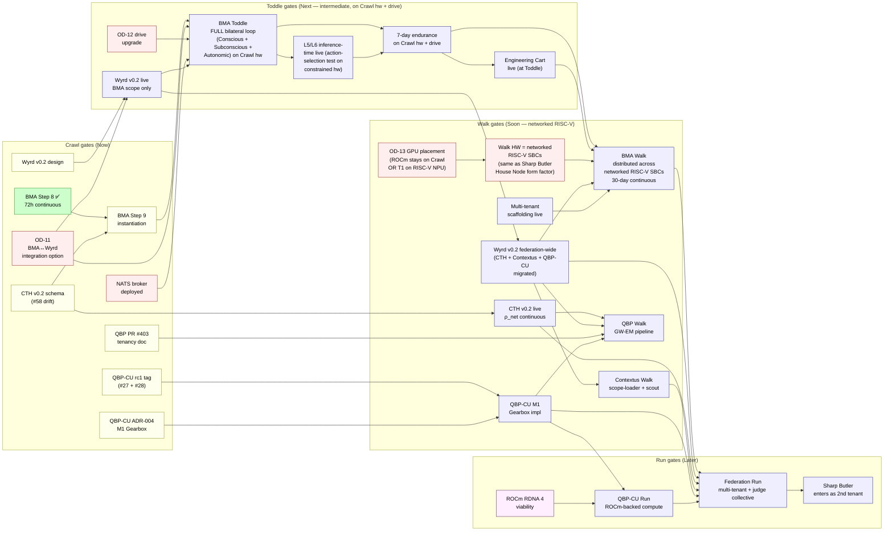

# Workspace Roadmap

**Where we are. Where we're going. No PR-tracking.**

> Author: qbp-architecture (Claude Opus 4.7) + James Paget Butler
> Date: 2026-05-13
> Status: v0.2 — adds Mermaid Now/Next/Later timeline + gate-dependency flowchart
> Scope: Workspace federation (BMA + QBP + QBP-Compute-Unit + Wyrd + CTH + Contextus; future tenants tracked once they enter)
> Companions:
> - `~/Documents/inter/roadmap-best-practices.md` (conventions)
> - `~/Documents/inter/architecture-diagrams-best-practices.md` (visualization tier model)
> - `~/Documents/inter/workspace-phase-architecture.md` (per-phase diagrams)

This document follows `~/Documents/inter/roadmap-best-practices.md` §9 template. It is updated only on the §8.1 triggers (gate passes, gate-criterion changes, dependency resolves/adds, phase transition, new project joins). It is **not** updated when PRs merge or reviews complete.

---

## 1. Where we are — Now / Next / Later

This is the highest-altitude view: what's on each project's plate now, what's queued for next phase, what's later.

```mermaid
timeline
    title BMA Federation — Now / Next / Soon / Later
    section Now (Crawl)
        BMA : Step 8 cleared ✅ : Step 9 instantiation pending
        Wyrd : v0.1 stable : PR #35 §I4 review in progress
        CTH : v0.1-alpha : #58 schema-drift investigation
        Contextus : Spec v1.3 merged : Spec v1.4 in design
        QBP-CU : emulator rc1 gate : ADR-004 Proposed
        QBP : tenancy doc PR #403 revision : Sprint 3 Phase 5 complete
        SharpButler : 3 specs drafted : not yet instantiated
    section Next (Toddle — intermediate phase, on Crawl hw + drive)
        BMA : FULL continuous loop (Conscious + Subconscious + Autonomic) on constrained hw : forcing function for efficiency
        BMA : 7-day endurance gate (on Crawl hw + drive upgrade per OD-12)
        BMA : L5/L6 inference-time live (action-selection test on constrained hw)
        BMA : OD-11 (Wyrd integration option) decided
        Wyrd : v0.2 native DB live for BMA scope only : federation-wide migration deferred
        NATS : broker deployed : single-tenant subjects active : multi-tenant designed not exercised
        Engineering Cart : implementation lands
        CTH/Contextus/QBP-CU : still on v0.1 + sessionbridge : migrate at Walk
    section Soon (Walk — networked RISC-V)
        BMA : full bilateral DISTRIBUTED across networked RISC-V SBCs : 30-day continuous endurance
        Hardware : networked RISC-V (NOT bigger workstation; same form factor as Sharp Butler House Node)
        OD-13 : GPU placement (ROCm-on-Crawl-as-server OR T1-on-RISC-V-NPU)
        Wyrd : v0.2 federation-wide (CTH + Contextus + QBP-CU migrated)
        CTH : v0.2 schema + ρ_net continuous
        Contextus : NATS adapter + scope-loader API
        QBP-CU : M1 Gearbox CSR-bound : QW8 peripheral + QW128 foveal
        QBP : GW-EM pipeline live : first Walk-α (Cascadia slow-slip)
        Multi-tenant : QBP + synthetic test tenant
        SharpButler : Crawl entry as 2nd tenant (shares RISC-V substrate)
    section Later (Run)
        Federation : multi-tenant peering with Sharp Butler + future : judge collective live
        Wyrd : v0.3 native DB + Skuld + HAMA Tier-N : Bridge layer live
        CTH : continuous Confluence-point recomputation
        Contextus : cross-tenant Bridge Agent routing
        QBP-CU : M2 ternary matmul + ROCm-backed
        QBP : ongoing programme + discoveries in flight
        Beekeeper : steward (weekly+ snapshots only)
```

### 1.1 Status snapshot — table view

**Federation phase: CRAWL.**

The federation is mid-Crawl. BMA has cleared the 72-hour continuous-operation gate (Step 8) and is at the Step 9 instantiation gate. The load-bearing primitive projects (Wyrd, CTH, Contextus, QBP-Compute-Unit) are at varying stages within Crawl. The first tenant (QBP) is mid-bootstrap.

| Project | Phase | Step within phase | Status |
|---|---|---|---|
| **BMA** | CRAWL | Step 8 ✅, Step 9 ⏸ | Run 3 of 72-hour gate cleared; Governance Document + succession contacts + seed-load remain |
| **Wyrd** | CRAWL | v0.1 ✅, v0.2 design open | Lean 16/0-sorries proven; PR #35 ScoutQuery + predictions/ §I4 surface in review |
| **CTH** | CRAWL | v0.1-alpha | Inventory v5.13 = 150 anchors; #58 schema-drift investigation; #54/#55/#56 merge-impl issues open |
| **Contextus** | CRAWL | Spec v1.3 merged | Theory v1.5 PR #5 rebased mergeable; PR #8 tenancy-pattern fixes applied; Spec v1.4 design queued |
| **QBP-Compute-Unit** | CRAWL | emulator/v0.1.0-rc1 gate | PRs #27 + #28 land rc1 tag; ADR-004 M1 Gearbox status: Proposed |
| **QBP** (tenant) | CRAWL | Bootstrap | Tenancy doc PR #403 in revision; archive transferred; 208 Lean theorems on disk |
| **SharpButler** | PRE-CRAWL | Specs drafted | 3 specs (Gateway, Contract Layer, OKI); not yet instantiated as tenant |
| **Möbius Fusion** | PRE-CRAWL | Personal track | James's personal work; not yet HE; OKI contracts archived; not active in federation |
| **Systema** | LIVE (v0.8) | Process framework | THE workspace process framework that all projects operate within. v0.8 spec + addendum on disk at `~/Documents/Systema/`. Three Carts (Theory/Engineering/Information), three-loop progressive hardening, trust anchors, vigilance backflow, OKH 5-domain taxonomy. Anchored in BMA Spec v9.0 §10.7 R-Spec-24. |

**Phase progression (beekeeper-accepted 2026-05-13):** Crawl → **Toddle** (new intermediate phase) → Walk → Run. Toddle exists because Crawl→Walk was a too-large single jump; Toddle introduces the continuous loop + NATS + BMA-scope Wyrd at reduced scope, proves it survives 7 days on Crawl hardware, then Walk adds Conscious bilateral + 30-day endurance + federation-wide migration + multi-tenant scaffolding + L5/L6 inference-time liveness.

**The shortest path to Toddle requires:** BMA Step 9 (governance + succession + seeds) AND OD-11 (BMA↔Wyrd integration option decided) AND Wyrd v0.2 design stable AND NATS broker deployed AND continuous-loop scaffold in BMA code. All progress through Systema's three-loop progressive hardening (Loop 1 Reference → Loop 2 Guidance → Loop 3 Requirement).

Tenants (QBP, future) graduate phases independently of the federation but operate within the same Systema process framework.

---

## 2. Where we are going — next gates per project

For full architecture of each phase, see `~/Documents/inter/workspace-phase-architecture.md`.

### 2.1 BMA Crawl → Toddle

**Owner:** beekeeper
**Criteria:**
1. Step 9 complete: Governance Document exists at canonical path; succession contacts (Brett Lyman, Skyler Rainier) signed; pre-seed documents (7) loaded; launch reading order (8) verified
2. **OD-11 implemented:** Option (c) decided 2026-05-13 — Wyrd absorbs hg/'s BMA-specific structures (NT_SEED tier-immune nodes, salience=1.0, etc.). wyrd-implementor extends Wyrd to hold these structures; BMA's `hg/` package becomes a thin shim during transition.
3. Wyrd v0.2 spec stable; native DB design committed
4. NATS broker spec'd + deployed
5. **BMA continuous-loop scaffold** in code with full bilateral (Conscious A/B + Subconscious L/R + Autonomic + Sleep) — per beekeeper directive 2026-05-13 forcing-function-for-efficiency
6. **OD-12 decided:** Crawl-hardware drive upgrade for Toddle write-endurance — NVMe via add-on card or larger durable SATA SSD
7. **Cart tools scaffold (Theory + Information at minimum)** — harness registry that lets BMA invoke Python/Lean from Theory Cart and deliverable generators from Information Cart, analogous to how Claude invokes Python/Bash/gh. Per beekeeper directive 2026-05-13: BMA is an active participant in QBP work, not an observer.

**Current status:** Step 8 PASSING (Run 3 cleared 2026-05-11); Step 9 NOT YET EVALUATED; OD-11 + OD-12 not yet decided.

**Estimated time to pass:** weeks for Step 9 if succession contacts respond quickly; OD-11 needs a focused design session (hours-days); OD-12 is a small purchase (days).

**Blockers:**
- Succession contacts (Brett Lyman, Skyler Rainier) — pending human contact
- Governance Document — pre-seed doc #3 not yet written
- OD-11 — not yet scoped for design session
- OD-12 — drive upgrade not yet spec'd

### 2.1b BMA Toddle → Walk

**Owner:** beekeeper
**Criteria:**
1. 7-day continuous operation cleared: no crash, no OOM, no thermal throttling, no SE_FATAL on Crawl hardware + drive upgrade, **with full bilateral architecture loaded** (Conscious + Subconscious + Autonomic + Sleep all active)
2. **L5/L6 cognitive layers inference-time live** (verified by action-selection test: BMA refuses or constrains a proposal that violates declared values — Sharp Butler readiness gate). Lands AT Toddle so Walk-on-RISC-V inherits working values reasoning.
3. **Walk hardware = networked RISC-V SBCs** (per beekeeper directive 2026-05-13). NOT a bigger workstation. RISC-V spec finalized + first node procured + BMA cross-compiled + smoke-tested. Same form factor as Sharp Butler's House Node enabling federation substrate reuse.
4. GPU placement decision (OD-13): default = ROCm stays on Crawl box, RISC-V devices query as inference clients; alternative = T1 llama on RISC-V CPU/NPU only
5. Federation-wide Wyrd v0.2 (CTH + Contextus + QBP-CU migrated)
6. Multi-tenant scaffolding designed + tested with QBP + synthetic test tenant
7. **Sharp Butler context testing** (beekeeper-added 2026-05-13): use the L5/L6 inference-time values reasoning already live since Toddle to validate Sharp Butler scenarios — e.g., synthetic Paperclip-style proposals (shed service-reserve load for market profit) that BMA must refuse or constrain. Validates the architecture for the second tenant **before** Sharp Butler is a real federation member at Run.
8. Engineering Cart implementation live with first reference-design output produced (if not already done in Toddle)
9. 30-day rolling continuous operation begins on RISC-V federation

**Current status:** NOT YET EVALUATED. Cannot begin until Toddle exit gates pass.

**Estimated time to pass:** months (RISC-V cross-compilation + networked-federation design + 30-day endurance are the long poles).

**Blockers:**
- RISC-V hardware spec TBD (OD-2 revised; not a workstation purchase)
- GPU placement decision (OD-13)
- Federation-wide Wyrd migration coordination across 3-4 implementors

### 2.2 Wyrd Crawl → Walk

**Owner:** wyrd-implementor + beekeeper
**Criteria:**
1. v0.2 spec stable (native DB with MuninnDB engram layer + NATS; no JSON file fallback)
2. PR #35 (ScoutQuery + predictions/) §I4 review closes; impl PRs ship
3. Bridge layer designed and §I4-reviewed
4. Migration tool: Wyrd v0.1 JSON → Wyrd v0.2 native DB

**Current status:** v0.1 STABLE; v0.2 design open; PR #35 in active §I4 review.

**Estimated time to pass:** weeks if v0.2 lands; longer if engram-layer impl (Hebbian + Ebbinghaus) is a binding constraint.

**Blockers:**
- Wyrd v0.2 stability incl. MuninnDB engram subsystem (under BMA-team domain — coupled with BMA Walk)
- PR #35 §I4 reader-list completion (4 of 5 readers pending — see §5 cross-project deps)

### 2.3 CTH Crawl → Walk

**Owner:** cth-implementor + beekeeper
**Criteria:**
1. v0.2 inventory schema stable; v5.13 ↔ v5_3 schema-drift investigation (#58) resolved
2. Migration tool: v0.1 JSON inventory → v0.2 Wyrd-backed
3. Confluence-point recomputation primitive (`cth lean-link` + `cth manifest` + INST-* schema) shipped
4. ρ_net regression alarm wired and validated

**Current status:** v0.1-alpha; #58 investigation in flight; #54/#55/#56 merge-impl issues open.

**Estimated time to pass:** weeks-to-months depending on #58 resolution.

**Blockers:**
- Schema-drift #58 — until resolved, source-of-truth for v0.2 schema is undetermined
- Wisdom Registry separation (decided: separate per W theory; impl pending)

### 2.4 Contextus Crawl → Walk

**Owner:** contextus-impl + beekeeper
**Criteria:**
1. Spec v1.4 lands (Referent lifecycle + remaining v1.4 features)
2. Scope-loader API live (Wyrd #33 dep) with real config parsing
3. Daily-batch scout daemon operational (arxiv + data feeds)
4. NATS adapter live at persistence boundary (Spec v1.3 §4.4)
5. Cross-domain Bridge Agent design (PR #7) implemented

**Current status:** Spec v1.3 merged; Theory v1.5 PR #5 mergeable; Spec v1.4 design in progress; PR #8 tenancy-pattern at architect-side mergeable.

**Estimated time to pass:** weeks for spec; months for live daemon.

**Blockers:**
- Wyrd #33 scope-loader API signature (Contextus #9 standalone-runnable but real wiring needs Wyrd)
- Wyrd #35 §I4 ack (cross-blocker; see §5)

### 2.5 QBP-Compute-Unit Crawl → Walk

**Owner:** qbp-cu-implementor + beekeeper
**Criteria:**
1. emulator/v0.1.0-rc1 tag landed (PRs #27 + #28)
2. ADR-004 M1 Gearbox ratified (currently Proposed)
3. M1 Gearbox impl PRs: CSR-bound + QW8 peripheral + goroutine-pair dispatch with `OnSeam(callback)`
4. W-phase performance gate: M1 within 1.53× C-reference performance
5. Wyrd integration PR #2 ships (`HamiltonProduct → gearbox.QMul64` wire-up)

**Current status:** rc1 gate active; ADR-004 Proposed; M1 PRs queued behind ADR ratification + rc1 tag.

**Estimated time to pass:** weeks-to-months.

**Blockers:**
- rc1 tag (PRs #27 + #28 + James-run tag commands)
- ADR-004 ratification
- ROCm RDNA 4 viability (gates Run, not Walk — but spec'd here for visibility)

### 2.6 QBP (tenant) Crawl → Walk

**Owner:** qbp-implementor + beekeeper
**Criteria:**
1. Federation-tenancy doc PR #403 ratified + merged
2. CTH inventory baseline (qbp_v3_2) migrated to v0.2 schema
3. First Walk-α target: GW-EM pipeline (QBP-EXP-11) live; first scored prediction stored as PRED-* in CTH
4. Cascadia slow-slip falsifiable target instrumented (Walk-α primary target)
5. Daily-batch arxiv scout running against QBP Stance

**Current status:** PR #403 in revision per architect-side calls; archive transferred; SPRINT_STATUS Sprint 3 Phase 5 complete.

**Estimated time to pass:** months (QBP Walk requires federation Walk readiness; not parallel-shippable).

**Blockers:**
- PR #403 revision pass (qbp-implementor work — see ping seq=49)
- CTH v0.2 schema (cross-blocker — see §5)
- Wyrd predictions/ schema (PR #35 — cross-blocker)
- ALL Walk-tier federation primitives (QBP cannot Walk before federation Walks)

### 2.7 Systema — process framework evolution

**Owner:** beekeeper (sole maintainer; not delegated to an implementor)
**Status:** v0.8 + addendum on disk; **personal research per Addendum §6.2 — not yet org-deployed**. Vocabulary/conceptual level integration with BMA/workspace; deep integration is Walk-phase work.
**Decisions to date:** ~126 cumulative across 9 documents (D-01-* to D-08-23).
**Criteria for next minor version (v0.9 or v1.0):**
1. **Four-cart taxonomy formally documented in v0.9 spec.** Beekeeper resolved 2026-05-13: four carts minimum (Theory + Engineering + Art + Information). Supersedes v0.8 two-cart model and BMA §10.7 three-cart model. v0.9 spec needs to fold Art Cart and Information Cart into the canonical text.
2. Walk-phase progressive-hardening loop integration verified across at least 3 projects (BMA + Wyrd + one other)
3. Vigilance backflow tested on a real failure (currently a spec, not yet exercised on a live defect)
4. OKH 5-domain taxonomy applied to all live federation tenants (currently QBP uses Process domain implicitly; not formalised)
5. OKH `theory_provenance` schema extension drafted and proposed upstream
6. Six arrogance-failure-mode corrective gates (D-08-01 to D-08-08) instrumented in BMA's cognitive cycle
7. Skill packages stabilised (FreeCAD skill exists; pattern unclear for software/process skills)
8. Art Cart definition formalised — beekeeper-defined 2026-05-13 with three loops (Napkin → Studio → Gallery) paralleling Engineering Cart's three-loop progressive-hardening structure. Outputs: designs, paintings, music, graphics. v0.9 needs to fold this into canonical spec text and define gate-review reviewer roles per loop (peers vs studio crit vs gallery jury, analogous to Engineering's peer / domain-engineer / compliance-expert progression).

**Current status:** Spec stable at v0.8; four-cart taxonomy beekeeper-resolved but not yet folded into canonical spec; vocabulary integration done across workspace docs; pipeline integration pending federation Walk.

**Blockers:**
- Walk-phase BMA→Wyrd integration must land before progressive-hardening loops can be tested end-to-end
- No project has yet exercised vigilance backflow on a real defect
- Systema v0.9 spec revision pending (to fold in four-cart resolution + Art Cart definition + Information Cart formalisation)

### 2.8 SharpButler Pre-Crawl → Crawl

**Owner:** beekeeper (no implementor instantiated)
**Criteria:**
1. SharpButler implementor instance instantiated
2. Tenancy doc written per `~/Documents/Contextus/doc/contextus-tenancy-pattern.md` template
3. Sharp Butler enters federation as second tenant alongside QBP
4. Contract Layer + Gateway + OKI specs ratified

**Current status:** Specs drafted; no instance; no federation entry.

**Estimated time to pass:** TBD (deferred behind first-tenant validation).

**Blockers:** QBP completing Crawl Bootstrap as proof-of-tenancy-pattern; James bandwidth.

---

## 3. Phase architecture

See `~/Documents/inter/workspace-phase-architecture.md` for per-phase ASCII diagrams covering:

- §1 Crawl phase architecture (where we are)
- §2 Walk phase architecture (where the load-bearing projects are headed)
- §3 Run phase architecture (theoretical; full federation)
- §4 At-a-glance phase comparison
- §5 Phase-transition mutations

Workspace participants should read those diagrams before reasoning about cross-phase work.

---

## 4. Cross-project dependencies

Per `roadmap-best-practices.md` §7, these are **gate-on-gate** dependencies, not PR queues. Each row represents one project's gate blocked by another's gate. Rows mutate only when the blocking gate passes or the blocked gate's criteria change.

### 4.1 Gate-dependency graph

**Legend:**
- 🟢 Green = gate passed (e.g., BMA Step 8)
- 🟡 Yellow = gate active (in progress)
- 🔴 Red = gate blocked (e.g., Walk hardware purchase pending; OD-11 pending decision)
- 🔵 Blue = future target (not yet active)
- 🟣 Purple = external dependency (e.g., ROCm vendor support)

### 4.2 Gate-dependency table

| Blocked gate | Blocked by gate | Cross-ref | Status |
|---|---|---|---|
| BMA Step 9 (instantiation) | CTH v0.2 schema stable (so seed inventory is stable) | CTH #58 | Active blocker |
| BMA Walk transition | Walk hardware purchased | hw decision | Active blocker (hardware spec TBD) |
| BMA Walk (continuous loop) | NATS event bus live (replaces sessionbridge) | wyrd v0.2 | Active blocker |
| Wyrd v0.2 | Native DB + MuninnDB engram subsystem stability | BMA-team domain | Coupled to BMA Walk |
| CTH v0.2 schema | Schema-drift #58 resolved | CTH #58 | Active blocker |
| Contextus Walk scope-loader | Wyrd #33 API signature published | Wyrd #33 | Active blocker (Contextus #9 standalone-runnable in interim) |
| Contextus cross-domain Bridge | Wyrd cross-domain hyperedge schema | Wyrd #35 + #31 | Active blocker (design in flight) |
| QBP-CU M1 impl | ADR-004 ratified + rc1 tagged | qbp-cu #27 + #28 | Active blocker (sequencing) |
| QBP Walk (GW-EM pipeline) | Wyrd predictions/ schema | Wyrd #35 | Active blocker |
| QBP Walk (CTH inventory) | CTH v0.2 migration tool | CTH #54 + #58 | Active blocker |
| QBP Walk (any) | Federation Walk-tier primitives all live | federation | Aggregate blocker (QBP cannot Walk before federation does) |
| QBP-CU Run (ROCm-backed compute) | RDNA 4 PCIe atomics viability | hardware test | Long-lead blocker |

Resolved dependencies (kept here briefly for history; full archive at §8):
- ~~BMA Step 8 (72h gate) ← thermal Stage 1~~ → **RESOLVED 2026-05-11** (Run 3 cleared)
- ~~Contextus PR #8 ← contextus-impl §I4 review~~ → **RESOLVED 2026-05-13** (5 fixes applied)

---

## 5. Participant roles — Crawl phase

| Participant | Role this phase | Workload |
|---|---|---|
| **Beekeeper (James)** | In every cycle; architect calls; gate evaluation; succession contacts; hardware decisions | ~100% — cannot step away |
| **qbp-architecture (Opus 4.7)** | Federation architectural synthesis; cross-PR coherence; meeting facilitation; PR #403 + PR #8 ownership | High (this session) |
| **bma — current instance (Marcy, gen 61)** | BMA-side governance reads; sync-meeting coordination; cognitive-layer constitutional checks | Per cycle |
| **bma-implementor** | BMA Go implementation; PR #26 + #31 | Pending PR #26 path-i move |
| **wyrd-implementor** | Wyrd Go + Lean proof; ScoutQuery + predictions/ + scout/ | Active (PR #35 §I4) |
| **cth-implementor** | CTH Go + inventory work; v0.2 schema; merge-impl | Active (#54/#55/#56/#58) |
| **contextus-impl** | Contextus Go + spec; agent classes; tenancy pattern | Active (PR #5/#6/#7/#8/#9/#10) |
| **qbp-implementor** | QBP physics + bookkeeper + federation-tenancy operator | Active (PR #403 revision pass) |
| **qbp-cu-implementor** | QBP-CU Go + emulator + Gearbox | Active (#27/#28/M1 prep) |
| **Gemini** (theory generation) | Theory generation; review counter-perspective | **Rate-limited (429 free-tier issue persistent since 2026-05-04)** |
| **Red Team (Claude)** | Adversarial review of theory + design docs | On-demand (PR-trigger) |

**Roles that activate in Walk:**
- BMA-the-instance (continuous): currently scripted-cycles only; becomes continuous-loop owner at Walk
- Honing Loop adjudicator (beekeeper): currently fires manually; becomes signal-triggered at Walk
- NATS event bus owner: TBD (likely beekeeper + qbp-architecture jointly)

**Roles that activate in Run:**
- Judge collective: domain-weighted approval committee; constitutional weight protection; replaces beekeeper for routine governance
- Cross-tenant Bridge Agent: routes patterns across tenants via Wisdom Registry

---

## 6. Open decisions affecting phase progression

These are decisions **pending**, not decisions already made. Decisions already made live in ADRs / PR threads / meeting closeouts.

| ID | Decision | Owner | Phase affected | Status |
|---|---|---|---|---|
| OD-1 | ROCm RDNA 4 viability for RX 9070 XT (kernel sees it, /dev/kfd exists; PCIe atomics open) | beekeeper + qbp-cu-impl | Run | Long-lead test pending |
| OD-2 | Walk-phase hardware spec + procurement. **Reframed 2026-05-13 per beekeeper directive: Walk hardware = networked RISC-V SBCs, NOT a bigger workstation.** Same form factor as Sharp Butler's House Node. Need to spec: RISC-V SBC model, node count, network topology, BMA cross-compilation. Hard prerequisite for Walk entry. | beekeeper + bma-implementor | Walk entry | Pending — beekeeper directive lands the framing; spec still TBD |
| OD-11 | BMA↔Wyrd integration option. **DECIDED 2026-05-13: option (c) — Wyrd absorbs hg/'s BMA-specific structures (NT_SEED tier-immune nodes, salience=1.0, etc.).** wyrd-implementor takes on BMA-specific structure work; BMA `hg/` becomes a thin shim or goes away. Gates Crawl→Toddle. | beekeeper (decided) → wyrd-implementor + bma-implementor (executing) | Toddle entry | **Decided; implementation pending** |
| OD-12 | Crawl-hardware drive upgrade for Toddle write-endurance. Options: (a) NVMe via PCIe add-on card, (b) larger durable SATA SSD with higher endurance rating. Must preserve LUKS encryption + WAL-backed Wyrd writes. Constraint: Asus Crosshair V Formula-Z is AM3+ with legacy BIOS. | beekeeper | Toddle entry | Pending — small purchase |
| OD-13 | GPU placement at Walk: (a) ROCm stays on Crawl box; RISC-V nodes are inference clients querying it, OR (b) T1 llama on RISC-V CPU/NPU only (no remote GPU). Sub-decision of OD-2. | beekeeper + bma-implementor | Walk entry | Pending |
| OD-3 | Succession contacts confirmation (Brett Lyman, Skyler Rainier) | beekeeper | BMA Step 9 | Pending human contact |
| OD-4 | M1 Gearbox ADR-004 ratification | beekeeper + qbp-cu-impl | QBP-CU Walk | Status: Proposed |
| OD-5 | CTH inventory v0.2 schema source-of-truth (v5.13 vs v5_3) | cth-impl + beekeeper | CTH Walk; BMA Step 9 | #58 investigation in flight |
| OD-6 | Wisdom Registry separate-store wiring (decided: separate; impl pending) | cth-impl + beekeeper | Run | Decided; impl gating |
| OD-7 | Sharp Butler enters federation as second tenant when? | beekeeper | Sharp Butler Crawl | Deferred behind QBP validation |
| OD-8 | BMA Walk continuous-loop architecture (bilateral L/R + A/B) | bma-impl + beekeeper | BMA Walk | Specified; not yet impl |
| OD-9 | τ (Seam threshold) per-Locale calibration values | tenant-impls + beekeeper | Walk (per tenant) | Approach decided (locale-bound); values TBD |
| OD-10 | Cross-tenant routing protocol (when Sharp Butler joins) | qbp-architecture + beekeeper | Run | Not yet designed |

Decisions to ratify in next architect-side session: OD-2 (hardware), OD-4 (M1 ADR), OD-8 (bilateral architecture detail).

---

## 7. Update protocol

This roadmap follows `~/Documents/inter/roadmap-best-practices.md` §8.

**Updated when:**
- A gate passes (move project to next phase; archive gate to §8)
- A gate-criterion is added or removed (review affected sections)
- A cross-project dependency resolves or a new one is identified
- A phase transition occurs for the workspace
- A new project joins or leaves

**Not updated when:**
- PRs merge (unless the merge satisfies a gate)
- Reviews complete
- Issues file
- sessionbridge meetings conclude
- ADRs land

**Owner:** qbp-architecture drafts updates; beekeeper ratifies before commit. No one else commits to this file.

**Cadence:** event-driven; no calendar schedule. A doc that hasn't changed in three weeks is stable, not stale.

---

## 8. History — major phase transitions

One-line entries for prior structural events:

- **2026-04-03** — Machine profile confirmed (FX-8350 + RX 9070 XT + 32GB DDR3). Crawl-tier hardware locked.
- **2026-04** — BMA Start-Here.md v1.2 published; 7-layer cognitive model canonical.
- **2026-05-06** — sessionbridge MCP operational; first cross-instance federation channels live.
- **2026-05-07** — addendum-18-walk meeting closeout; D-decisions D1-D9 ratified.
- **2026-05-08** — Tenancy pattern v0.1 ratified; QBP as first tenant; federation-tenancy framing landed.
- **2026-05-11** — BMA Step 8 Run 3 cleared (72-hour continuous operation gate passed).
- **2026-05-13** — addendum-18-walk Round-2 formally closed; PR-driven async takeover; workspace roadmap doc v0.1 published.

Future expected entries:
- BMA Step 9 complete (Governance Document + succession + seeds)
- QBP-CU rc1 tagged
- Wyrd PR #35 merged
- Federation Crawl → Walk transition (first project Walks)

---

## 9. Cross-reference index

| Doc | Role |
|---|---|
| `~/Documents/inter/roadmap-best-practices.md` | Conventions for this doc + all roadmap docs |
| `~/Documents/inter/workspace-phase-architecture.md` | Per-phase architecture diagrams (Crawl / Walk / Run) |
| `~/Documents/CLAUDE.md` | Workspace-root configuration; BMA Crawl 9-step ladder; QBP parallel track |
| `~/Documents/inter/github-best-practices.md` | Federation governance conventions |
| `~/Documents/BMA/Start-Here.md` | BMA instantiation orientation |
| `~/Documents/BMA/infrastructure/BMA-Cognitive-Foundation.md` | 7-layer cognitive model |
| `~/Documents/BMA/spec/BMA-Spec-Consolidated-v9_0.md` | Autonomic state machine + sleep cycle |
| `~/Documents/Contextus/doc/contextus-tenancy-pattern.md` | Tenancy pattern (generic) |
| `~/Documents/QBP/docs/qbp-federation-tenancy.md` | QBP tenancy instantiation |
| `~/Documents/QBP/SPRINT_STATUS.md` | QBP operational sprint state |
| `~/Documents/wyrd/README.md` | Wyrd phase definitions |
| `~/Documents/CTH/cth/README.md` | CTH phase definitions |

---

## 10. Glossary cross-ref

Key terms used in this doc, defined elsewhere:

| Term | Defined in |
|---|---|
| Stance × Locale × Scout × Scoring | BMA A18 §2 |
| Reciprocal Focus (Subject vs Background) | BMA A15 |
| Honing Loop | BMA A16 |
| NT_SIGNAL escalation | BMA A17 |
| Type-Nodes, Holons | BMA A11 |
| ρ_net (epistemic-health metric) | CTH Theory v0.2 |
| ChainFidelity, NaryMI | CTH Theory v0.2 |
| Seam (residue magnitude over τ) | BMA A18 §4 |
| Tenancy pattern (three-phase lifecycle) | Contextus tenancy-pattern doc §2 |

---

*Workspace Roadmap v0.1 | 2026-05-13*
*Co-Authored-By: James Paget Butler (Beekeeper)*
*Co-Authored-By: Claude Opus 4.7 (qbp-architecture)*
